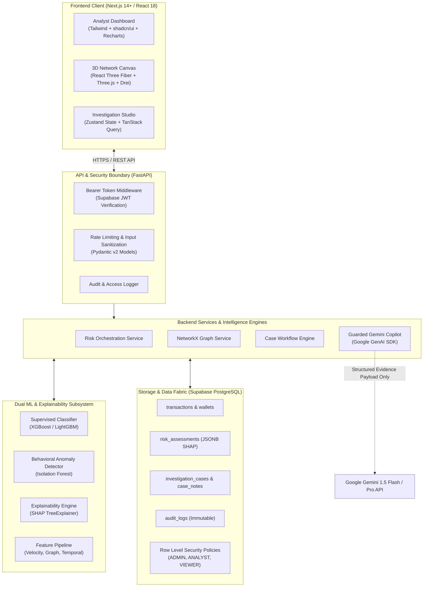
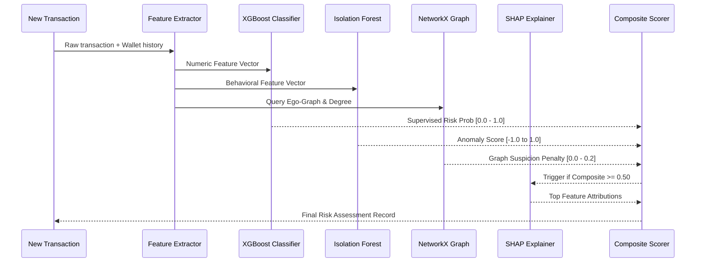
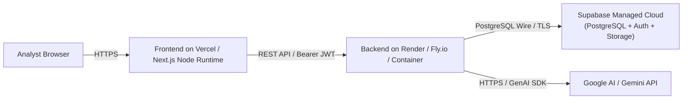

# UpayAche — System Architecture Specification

> **Document Version**: 1.0.0  
> **Status**: Approved Architecture Baseline  
> **Target System**: Production-Grade Hackathon Prototype  
> **Stack Summary**: Next.js (App Router, TS, Tailwind, Three.js) + FastAPI (Python 3.12, XGBoost, SHAP, NetworkX) + Supabase (Postgres, Auth, RLS) + Gemini (Google GenAI SDK)

---

## 1. High-Level System Architecture



---

## 2. Frontend Architecture (`/frontend`)

The frontend is built with Next.js using the App Router, strictly written in TypeScript, and styled with Tailwind CSS and shadcn/ui components.

### 2.1 Technology Stack
- **Framework**: Next.js 14 (App Router)
- **Language**: TypeScript (strict mode, zero `any` tolerance)
- **Styling**: Tailwind CSS + shadcn/ui primitives + CSS Modules for canvas overlays
- **3D Graph Canvas**: Three.js, React Three Fiber (`@react-three/fiber`), and `@react-three/drei`
- **State Management**: Zustand (client UI state: selected nodes, active drawer, filter tokens)
- **Data Fetching & Cache**: TanStack Query (`@tanstack/react-query`) with automatic background refetching and optimistic mutations
- **Form & Payload Validation**: Zod with `react-hook-form`
- **Charts & Metrics**: Recharts (for SHAP waterfall, ROC curves, and velocity trends)

### 2.2 Directory Structure
```
frontend/
├── src/
│   ├── app/
│   │   ├── (auth)/
│   │   │   └── login/page.tsx             # Supabase Auth login
│   │   ├── (dashboard)/
│   │   │   ├── layout.tsx                 # Sidebar, header, user role badge
│   │   │   ├── page.tsx                   # Overview: risk metrics, critical alerts
│   │   │   ├── transactions/
│   │   │   │   ├── page.tsx               # Filterable risk ledger
│   │   │   │   └── [id]/page.tsx          # Transaction deep dive + SHAP
│   │   │   ├── network/
│   │   │   │   └── page.tsx               # 3D interactive wallet graph
│   │   │   ├── cases/
│   │   │   │   ├── page.tsx               # Case board (OPEN, INVESTIGATING, REVIEWED, CLOSED)
│   │   │   │   └── [caseId]/page.tsx      # Case detail, notes, timeline
│   │   │   └── analytics/
│   │   │       └── page.tsx               # Model ROC-AUC, latency, scam typologies
│   ├── components/
│   │   ├── ui/                            # shadcn/ui primitives (button, card, dialog, badge)
│   │   ├── common/                        # StatusBadge, RiskGauge, Header, Navigation
│   │   ├── network/
│   │   │   ├── NetworkCanvas3D.tsx        # Canvas, OrbitControls, Node Meshes, Edge Beams
│   │   │   ├── NodeDetailsDrawer.tsx      # Slide-over wallet attributes
│   │   │   └── GraphToolbar.tsx           # Depth slider, edge type toggle, search
│   │   ├── risk/
│   │   │   ├── ShapWaterfallChart.tsx     # Recharts horizontal waterfall
│   │   │   └── RiskScoreCard.tsx          # Composite score with factor breakdowns
│   │   └── investigation/
│   │       ├── GeminiCopilotPanel.tsx     # AI investigation chat & recommendations
│   │       ├── CaseStatusSelect.tsx       # State transition control with validation
│   │       └── NoteEditor.tsx             # Markdown analyst notes
│   ├── hooks/                             # Custom TanStack query hooks (useTransactions, useRisk)
│   ├── stores/                            # Zustand stores (useGraphStore, useInvestigationStore)
│   ├── lib/
│   │   ├── api.ts                         # Typed Axios/Fetch client with interceptors
│   │   ├── supabase.ts                    # Supabase browser client
│   │   └── utils.ts                       # Currency (BDT ৳), date/time formatters
│   └── types/                             # Shared TypeScript interfaces (mirrors backend schemas)
```

### 2.3 3D Network Visualization Design (Three.js / React Three Fiber)
- **Node Geometry**: Instanced spheres or individual sphere meshes color-coded by wallet risk tier (Green: Low, Amber: Medium, Crimson: High, Magenta: Critical).
- **Edge Geometry**: Line segments or extruded cylinder tubes with particle pulses indicating money flow direction.
- **Layout Algorithm**: Force-directed 3D layout (Fruchterman-Reingold / D3-force-3d) calculated on the worker thread or precomputed on the backend.
- **Interactions**:
  - Hover: Node tooltip displaying masked phone number, wallet type, and cumulative volume.
  - Click: Center camera with smooth tween, open `NodeDetailsDrawer`, fetch 1-hop and 2-hop connected peers.

### 2.4 Analyst Dashboard Architecture (`/dashboard`)
Implemented in Phase 12 under the UpayAche Fintech Design System with **zero hardcoded statistics**:
- **Fintech Header**: Custom UpayAche brand badge (warm fintech yellow `#EAB308` & navy `#0F172A`), active analyst session (`analyst@upayache.internal`), notifications bell indicator, and profile menu.
- **Primary Metrics**: 4 real-time KPI cards (`Total Transactions`, `High-Risk Transactions`, `Active Investigations`, `Behavioral Anomalies`) featuring live counts, data source lineage tags, descriptions, and trend badges.
- **Quick Actions Grid**: Mobile-finance inspired 6-cell service grid:
  1. *Analyze Transaction* (launches interactive ML scoring modal)
  2. *Investigate Alerts*
  3. *Explore Network*
  4. *View Investigations*
  5. *View Analytics*
  6. *Model Performance*
- **Risk Overview (Recharts)**:
  - *Risk Distribution*: Interactive Donut chart mapping Low, Medium, High, and Critical risk volumes.
  - *Risk & Alert Trend*: Dual-area gradient chart tracking 7-day high-risk velocity.
  - *Transaction Volume*: Monochromatic bar chart displaying total daily BDT volume.
- **High-Risk Transactions**: Live transaction table with risk score badges, formatted BDT amounts, timestamps, and an "Inspect" action that opens the SHAP feature attributions modal.
- **Suspicious Networks**: Hub cards displaying connected wallet count, transaction volume, and direct links to the 3D network view.
- **Active Investigations**: Case docket table tracking Case ID, priority, status machine state, and assigned analyst.
- **Model Status**: Live model card displaying version (`v1.0.0`), training timestamp, Precision (1.000), Recall (0.987), F1 (0.993), ROC-AUC (1.000), and synthetic data evaluation disclaimer.
- **Responsive Layout**: Full desktop sidebar + responsive card grid; mobile header + compact cards + sticky bottom navigation.

### 2.5 Transaction Investigation UI (`/transactions` & `/transactions/[id]`)
Implemented in Phase 13 under the UpayAche Fintech Design System:
- **Transaction Ledger (`/transactions`)**:
  - Clean financial-data table displaying 10 columns: Transaction ID (with hash & copy button), Sender (masked phone + wallet ID), Receiver (masked phone + wallet ID), Amount (`৳` BDT formatted), Timestamp (UTC), Risk Score, Risk Level (`LOW`, `MEDIUM`, `HIGH`, `CRITICAL`), Anomaly status, Status (`COMPLETED`), and Investigate action.
  - Interactive toolbar with free-text search across hash/ID/wallets/patterns, risk level filter, transaction type filter, start & end date pickers, column sorting (timestamp, amount, risk score), and pagination controls.
  - Mobile responsiveness: Automatically converts financial table into high-density mobile cards with amount banners and one-tap investigation routing.
- **Transaction Deep-Dive & Investigation Studio (`/transactions/[id]`)**:
  - **Fintech Header**: Shows Tx ID, hash, Risk Tier badge, composite Risk Score, active case status (`INVESTIGATING`, `OPEN`, `REVIEWED`, `CLOSED`, or `NO_ACTIVE_CASE`), and instant re-scoring trigger.
  - **Transaction Information Card**: Origin wallet with masked phone, destination wallet, BDT amount banner, hardware device ID, location ID, transaction routing type, and status.
  - **Prominent Risk Analysis Card**: Circular gauge for composite risk score, tier classification, binary ML verdict (`FRAUD FLAGGED (1)` vs `LEGITIMATE (0)`), model version, expected baseline, and dynamic ML risk narrative.
  - **SHAP Feature Attributions**: Top risk factors derived strictly from real XGBoost TreeExplainer SHAP values (numeric contribution, feature value, `Increased Risk` / `Decreased Risk` badges, and deterministic explanations; zero hallucinated attributions).
  - **Behavioral Anomaly Analysis**: Unsupervised Isolation Forest anomaly score, behavioral status badge, and multi-dimensional observed signals (device consistency, temporal nocturnal flags, velocity deviations).
  - **Action Suite**:
    - *Investigate*: Contextual evidence focus.
    - *Create Case*: In-flight modal instantiating a new investigation case via `POST /api/v1/investigations`.
    - *View Wallet & Explore Network*: Direct deep-links to `/network?wallet=...`.
    - *Ask AI*: Guarded Gemini Copilot dossier modal running via `POST /api/v1/ai/investigate`. Synthesizes executive summary, scam typology, confidence level, key indicators, and human compliance actions with strict non-financial execution guardrails.

### 2.6 3D Wallet Network Explorer (`/network` & `/network/[walletId]`)
Implemented in Phase 14 using Three.js, React Three Fiber (`@react-three/fiber`), and Drei (`@react-three/drei`):
- **Visual Style & Environment**:
  - Dedicated financial intelligence visualization canvas set on a dark navy backdrop (`#0B1120`), subtle 3D floor coordinate grid, directional lighting, and clean floating billboard HTML badges. Designed specifically to avoid excessive gaming/cyberpunk styling in favor of an institutional fintech intelligence aesthetic.
- **Graph Topology & Nodes**:
  - **Wallet Nodes**: Modeled as 3D metallic spheres with radius proportional to transaction degree.
  - **Risk Tier Visual Encoding**:
    - Low: Neutral Sky Blue / Emerald (`#38BDF8`).
    - Medium: Amber (`#F59E0B`).
    - High: Alert Orange (`#F97316`).
    - Critical: Crimson (`#EF4444`) with an animated pulsing halo wireframe ring to ensure visual salience does not rely on color alone.
  - **Directed Edges**: Directed transaction vectors with flow direction cone markers positioned at 65% of the vector path. Highlights in fintech yellow (`#EAB308`) when connected to the active node.
- **Camera & Interaction Engine**:
  - Full Orbit, Zoom, Pan, and Reset via Drei `OrbitControls` with smooth spherical damping.
  - Interactive click-to-select: Dimming of unrelated graph components, persistent focus centering, and floating HUD labels.
- **Inspector Side Panel (`WalletInspectorDrawer`)**:
  - Displays wallet identity, masked phone number, risk tier, PageRank centrality score, inbound/outbound volume, counterparty count, suspicious neighbor counts, and circular money-layering loop alerts (`in_cycle`).
  - Action integration: **View Ledger Transactions** (`/transactions?wallet_id=...`), **Create Investigation Case** (`POST /api/v1/investigations`), and **Open Case**.
- **Dual View Modes**:
  - Global Network View (`/network`): Evaluates core high-degree network structure.
  - Ego-Network View (`/network/[walletId]`): Dedicated 1-hop / 2-hop ego exploration around a target suspect wallet.

---

## 3. Backend Architecture (`/backend`)

The backend is built as a modular FastAPI micro-service in Python 3.12, adhering strictly to clean architecture principles.

### 3.1 Technology Stack
- **Framework**: FastAPI (async ASGI)
- **Data Validation**: Pydantic v2
- **Data Processing**: Pandas, NumPy
- **Machine Learning**: Scikit-Learn, XGBoost
- **Graph Modeling**: NetworkX
- **Explainable AI**: SHAP (TreeExplainer)
- **Database Client**: Supabase Python Client / AsyncPG
- **AI Integration**: Official `google-genai` SDK

### 3.2 Directory Structure
```
backend/
├── app/
│   ├── main.py                     # App factory, middleware, CORS, lifecycle hooks
│   ├── core/
│   │   ├── config.py               # Pydantic BaseSettings (.env loading)
│   │   ├── security.py             # JWT decode, role dependencies (ADMIN, ANALYST, VIEWER)
│   │   └── logging.py              # Structured JSON logging
│   ├── schemas/                    # Pydantic v2 request & response models
│   │   ├── transaction.py
│   │   ├── wallet.py
│   │   ├── risk.py
│   │   ├── network.py
│   │   ├── investigation.py
│   │   └── audit.py
│   ├── db/
│   │   ├── supabase.py             # Supabase client initializer
│   │   └── repositories/           # DB repositories (transactions, cases, audit)
│   ├── ml/
│   │   ├── pipeline.py             # Feature extraction from transaction logs
│   │   ├── model.py                # XGBoost classifier loader & predictor
│   │   ├── anomaly.py              # Isolation Forest anomaly scorer
│   │   └── explainer.py            # SHAP explainer service
│   ├── graph/
│   │   ├── builder.py              # NetworkX DiGraph builder from transactions
│   │   └── patterns.py             # Smurfing, cycle detection, PageRank algorithms
│   ├── services/
│   │   ├── risk_service.py         # Orchestrates ML + Anomaly + Graph + Explainer
│   │   ├── case_service.py         # State machine logic (OPEN -> INVESTIGATING -> etc.)
│   │   └── gemini_assistant.py     # Guarded Google GenAI prompt orchestration
│   └── api/
│       └── v1/
│           ├── router.py           # Master v1 router
│           ├── endpoints/
│           │   ├── transactions.py # Ingestion & ledger query endpoints
│           │   ├── risk.py         # Risk scoring & SHAP endpoints
│           │   ├── network.py      # Node/edge graph payload endpoints
│           │   ├── cases.py        # Case management & notes endpoints
│           │   ├── assistant.py    # Gemini investigation endpoints
│           │   └── analytics.py    # Evaluation & system metric endpoints
├── data/
│   ├── generator.py                # Synthetic MFS transaction engine
│   └── seed_scenarios.py           # Fraud topologies (mule rings, smurfing, cashouts)
├── tests/
│   ├── test_features.py
│   ├── test_models.py
│   ├── test_graph.py
│   └── test_api.py
└── requirements.txt
```

---

## 4. Database Architecture (Supabase PostgreSQL)

Supabase PostgreSQL is the source of truth for transactions, risk evaluations, cases, and audit logs. All tables enforce strict foreign key constraints, indexes, and Row Level Security (RLS).

### 4.1 Core Tables & Relationships
- `profiles`: Extends `auth.users` with application role (`ADMIN`, `ANALYST`, `VIEWER`).
- `wallets`: Master record of synthetic MFS wallets (masked phone, balance, wallet type: `PERSONAL`, `AGENT`, `MERCHANT`).
- `transactions`: Immutable transaction ledger (sender, receiver, amount, timestamp, fee, type).
- `risk_assessments`: Evaluated risk scores, anomaly score, and JSONB SHAP attributions.
- `investigation_cases`: Lifecycle entity (`OPEN`, `INVESTIGATING`, `REVIEWED`, `CLOSED`).
- `case_notes`: Threaded analyst and AI summary notes.
- `audit_logs`: Immutable security log tracking every state change and query.

*(Detailed schema, indexes, and RLS policies are fully detailed in [DATABASE.md](file:///c:/Users/arkos/OneDrive/Arko%20-%20Personal/Desktop/DIU%20Hacka/docs/DATABASE.md))*

---

## 5. ML & Explainability Pipeline



---

## 6. Guarded AI Architecture (Gemini via Google GenAI SDK)

### 6.1 Architectural Boundary
Gemini is strictly an **analytical intelligence assistant**. It does **NOT**:
- Classify or score transactions.
- Execute SQL queries or database updates.
- Transfer funds or freeze wallets.
- Interact directly with frontend clients.

### 6.2 Safe Context Pipeline
1. Backend retrieves the target transaction, its SHAP top 5 features, and its 2-hop graph summary.
2. Backend constructs a strictly typed, sanitized JSON evidence dossier.
3. Backend invokes Gemini with a strict system prompt and enforces a Pydantic response schema.
4. The synthesized response is returned to the analyst for human review.

---

## 7. Deployment & Infrastructure Architecture



### 7.1 Local Development Environment (Hackathon Prototype)
- **Frontend**: `http://localhost:3000` (Next.js Dev Server)
- **Backend**: `http://localhost:8000` (Uvicorn / FastAPI ASGI server)
- **Database**: Supabase Cloud Project (free tier) or Local Supabase Docker instance
- **Environment**: Strict `.env` files with zero checked-in secrets.

---

## 8. Phased Development Plan (3-Day Execution)

| Phase | Focus Area | Deliverables |
| :--- | :--- | :--- |
| **Day 1: Morning** | Architecture & Scaffolding | Requirements docs, repo structure, environment configurations, dependencies |
| **Day 1: Afternoon** | Data & Graph Pipeline | Synthetic MFS transaction generator, scam topologies (smurfing, mule rings), NetworkX graph builder |
| **Day 1: Evening** | ML Engine & SHAP | Feature extraction pipeline, XGBoost training, Isolation Forest, SHAP TreeExplainer service |
| **Day 2: Morning** | Backend API & DB | FastAPI v1 endpoints, Pydantic contracts, Supabase schema, RLS policies, audit logging |
| **Day 2: Afternoon** | Guarded Gemini Copilot | Official GenAI SDK integration, evidence prompt packaging, structured JSON response parser |
| **Day 2: Evening** | Frontend Core UI | Next.js layout, dark fintech theme, Overview Dashboard, filterable Risk Ledger, SHAP waterfall |
| **Day 3: Morning** | 3D Network Visualization | Three.js / React Three Fiber interactive graph, node drawer, camera controls, edge animation |
| **Day 3: Afternoon** | Case Management & Workflow | Investigation studio, status state machine (`OPEN` → `INVESTIGATING` → `REVIEWED` → `CLOSED`), notes |
| **Day 3: Evening** | QA, Latency Benchmarks & Demo Prep | End-to-end integration tests, seed scenario verification, demo script rehearsal, final polish |

---

## 9. Fintech Design System Architecture (Phase 11)

### 9.1 Visual Language & Design Tokens
- **Warm Fintech Yellow (`#F59E0B` / `#FBBF24`)**: Primary brand identity for high-visibility highlights, active indicators, and primary CTAs.
- **Deep Navy Dark Blue (`#0F172A` / `#1E293B`)**: Secondary anchor for sidebar navigation, high-contrast actions, and security intelligence frames.
- **Content Surfaces**: Neutral white (`#FFFFFF`) card surfaces with light slate background (`#F8FAFC`), crisp subtle borders (`#E2E8F0`), and soft shadows (`shadow-2xs`, `shadow-xs`).
- **Semantic Risk Hierarchy**:
  - `LOW` = Green (`#10B981` / `#ECFDF5`)
  - `MEDIUM` = Amber (`#F59E0B` / `#FFFBEB`)
  - `HIGH` = Orange/Red (`#EA580C` / `#FFF7ED`)
  - `CRITICAL` = Deep Red (`#DC2626` / `#FEF2F2`)

### 9.2 Responsive Shell & Viewport Architecture
- **Desktop Layout**:
  - Left navigation sidebar (`w-64` or `w-20` collapsed) with module navigation (Dashboard, Transactions, Investigations, Network, Analytics, Models) and bottom utilities (Settings, Profile, Logout).
  - Sticky top header with search trigger (`⌘K`), ML engine status, notifications, and active role pill.
- **Mobile-First Layout**:
  - Dedicated fixed bottom navigation bar (`Home`, `Transactions`, `Investigations`, `Network`, `More`).
  - Drawer backdrop for secondary navigation without shrinking the desktop layout.

### 9.3 Reusable Component Catalog (26 Components)
1. `AppShell`: Master responsive wrapper integrating sidebar, top header, mobile nav, and drawer.
2. `Sidebar`: Desktop left navigation bar.
3. `MobileBottomNav`: Dedicated mobile bottom navigation bar.
4. `TopHeader`: Top app header with search, notifications, live status, and role badge.
5. `PageHeader`: Breadcrumbs, title, description, and action button toolbar.
6. `MetricCard`: KPI card with tabular numbers, delta indicators, and risk context.
7. `RiskBadge`: Semantic risk badge with score and pulsating critical indicator.
8. `StatusBadge`: Investigation state machine badge (`OPEN`, `INVESTIGATING`, `REVIEWED`, `CLOSED`).
9. `TransactionCard`: Compact mobile transaction card with counterparty tracing and anomaly flag.
10. `TransactionTable`: Desktop responsive transaction ledger with tabular numerals and risk pills.
11. `ServiceCard`: Compact grid action card inspired by mobile-finance quick tiles.
12. `ChartCard`: Chart container with time-range tabs (`1H`, `24H`, `7D`, `30D`).
13. `AlertCard`: High-priority risk alert sentinel card with trigger factors and triage actions.
14. `WalletCard`: MFS wallet profile card with balance, device count, and hourly velocity.
15. `InvestigationCard`: Investigation case card with priority, analyst assignment, and notes counter.
16. `AIInsightCard`: Security intelligence card with SHAP feature attributions and anomaly score.
17. `NetworkPreviewCard`: Graph topology preview with degree, flow, cycles, and risk nodes.
18. `SearchBar`: Fintech search input with category filter dropdown and keyboard shortcut hint.
19. `FilterBar`: Horizontal scrolling chip filter bar with counts and active states.
20. `DataTable`: Generic accessible sortable and paginated table component.
21. `EmptyState`: Clean empty state placeholder with action button.
22. `LoadingState`: Skeleton loading placeholders for metrics, tables, lists, and cards.
23. `ErrorState`: Telemetry and API error display with retry action.
24. `ConfirmationDialog`: Accessible modal dialog for critical or destructive state transitions.
25. `Modal`: Accessible general dialog overlay with focus trap and escape key listener.
26. `Tooltip`: Accessible micro-hover explanation tooltip.

---

## 10. AI Investigation Assistant & Workspace Architecture (Phase 15)

### 10.1 Desktop 3-Column Layout: `Evidence | Investigation | AI Assistant`
The investigation workspace (`/investigations/[caseId]`) integrates deep forensic evidence, workflow state transitions, and an AI intelligence synthesis copilot in a unified 3-column panoramic layout:
- **Column 1 — Evidence Dossier**:
  - Direct triggering transaction details (amount, velocity, device/IP, timestamp).
  - Supervised XGBoost risk score and unsupervised Isolation Forest anomaly rating.
  - Top SHAP feature contributions (with positive/negative risk direction vectors).
  - Counterparty graph metrics and one-click launch to the interactive 3D Wallet Explorer (`/network/[walletId]`).
- **Column 2 — Investigation Lifecycle & Note Stream**:
  - Rationale, severity, and current status (`OPEN` → `INVESTIGATING` → `REVIEWED` → `CLOSED`).
  - Strict finite state machine transition controls preventing illegal jumps (e.g. `OPEN` to `CLOSED` directly).
  - Explicit resolution requirement when marking `CLOSED`: `CONFIRMED_FRAUD`, `FALSE_POSITIVE`, `SUSPICIOUS_MONITOR`.
  - Chronological note stream for human analyst findings and automated synthesis inserts.
- **Column 3 — Guarded AI Copilot Panel (`AIInvestigationPanel`)**:
  - Live status indicators: `Evidence-grounded` & `AI-generated`.
  - Quick forensic questions: Flag rationale, strongest risk factors, unusual behavioral patterns, connected wallets, and verification targets.
  - Structured, typed output displaying Executive Summary, Grounded Evidence, Relevant Risk Factors, Network Topology Indicators, and Recommended Actions.
  - Quick action: "Insert Synthesis into Case Notes" to streamline formal reporting.

### 10.2 Guardrail Invariants
- **Evidence-Only Grounding**: The AI receives strictly pre-validated, sanitized JSON dossiers assembled by `AICopilotService` and never hallucinates external facts.
- **Zero Autonomous Execution**: Gemini is strictly an investigative copilot. It has NO permission or interface to execute SQL, mutate database state, approve/deny transactions, freeze/block wallets, alter balances, or access secrets.

---

## 11. Investigation Workspace Architecture (Phase 16)

### 11.1 Routes & Navigation Structure
- **`/investigations`**: Master compliance docket featuring case counts by lifecycle status, status tabs (`ALL`, `OPEN`, `INVESTIGATING`, `REVIEWED`, `CLOSED`), priority filter, search, case creation modal, and direct links to active workspaces.
- **`/investigations/[id]`**: Primary analyst forensic workspace integrating all investigation modules into a panoramic intelligence terminal.

### 11.2 Workspace Layout & Module Breakdown
1. **Top Bar Header & Actions**:
   - Case ID, Risk Level Badge, Priority Badge, Status Badge, Assigned Analyst, Created At, and Updated At.
   - Mutation actions:
     - `Change Status`: Enforces the finite state machine (`OPEN` → `INVESTIGATING` → `REVIEWED` → `CLOSED`), requiring resolution selection (`CONFIRMED_FRAUD`, `FALSE_POSITIVE`, `SUSPICIOUS_MONITOR`) upon closure.
     - `Assign Case`: Reassigns case investigator to internal compliance specialists.
     - `Add Note`: Captures verified intelligence and findings into the case timeline.
   - RBAC guard: VIEWER role is blocked from mutations with explicit read-only UI indicators.
2. **Forensic Evidence Sections**:
   - **Transaction Evidence**: Transaction hash, amount in BDT, transaction type, sender/receiver wallets, timestamp, hardware device ID, pattern, and geographic location ID.
   - **Risk Analysis**: Composite risk score, supervised XGBoost probability, alert threshold delta, and detection typology.
   - **SHAP Explanation**: Additive feature attributions with contribution scores, positive/negative risk direction indicators, and plain-English explanations.
   - **Behavioral Anomaly**: Unsupervised Isolation Forest score, nocturnal transaction flag, device switch alert, and historical volume surge multiplier.
   - **Wallet Network**: Embedded `CompactNetworkPreview` displaying ego topology, degree, suspicious neighbors, concentration index, PageRank centrality, and a direct `Open Full Network` button linking to the interactive 3D visualizer at `/network/[walletId]`.
3. **AI Copilot Integration**:
   - Embedded `AIInvestigationPanel` supporting evidence-grounded responses to 5 standard prompts and custom inquiries, with direct insertion of synthesis into case notes.
4. **Analyst Notes Timeline**:
   - Chronological stream displaying author, timestamp, note type (`ANALYST`, `AI_COPILOT`, `SYSTEM`), and content with an inline composer.
5. **Case Status Lifecycle & History**:
   - Visual 4-step state stepper and dedicated table detailing all status changes, operators, and transition rationales.
6. **Forensic Audit Trail**:
   - Immutable append-only log entries showing action, user/role, metadata details, and UTC timestamps.

