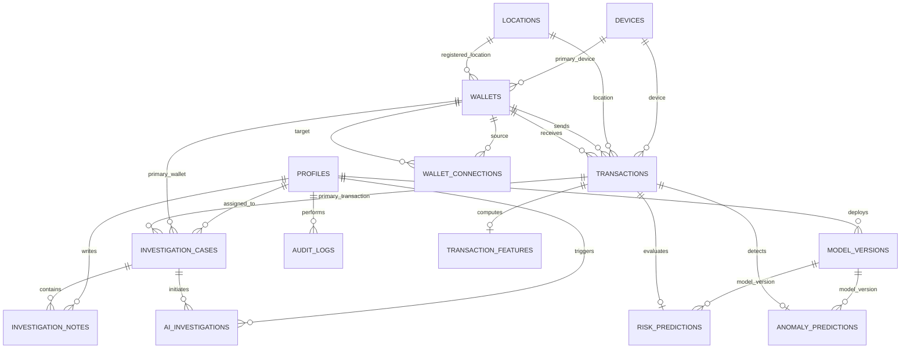

# UpayAche — Database Architecture & Schema Specification

> **Document Version**: 2.0.0  
> **Status**: Production Baseline  
> **Engine**: Supabase PostgreSQL 15+  
> **Features**: UUID PKs, Strict Referential Integrity, JSONB for SHAP & Feature Vectors, Row Level Security (RLS), Immutable Audit Trail, Zero PII.

---

## 1. Entity-Relationship Overview



---

## 2. Table Specifications & Schema Contracts

### 2.1 Domain Enums

| Enum Name | Allowed Values | Description |
| :--- | :--- | :--- |
| `user_role` | `ADMIN`, `ANALYST`, `VIEWER` | Role-Based Access Control tiers |
| `wallet_type` | `PERSONAL`, `AGENT`, `MERCHANT` | MFS account classification |
| `risk_level` | `LOW`, `MEDIUM`, `HIGH`, `CRITICAL` | Risk severity and priority scoring |
| `wallet_status` | `ACTIVE`, `SUSPENDED`, `WATCHLIST`, `FROZEN` | Operational status of MFS wallet |
| `tx_type` | `P2P`, `CASH_IN`, `CASH_OUT`, `PAYMENT`, `RECHARGE` | Transaction taxonomy |
| `tx_status` | `COMPLETED`, `REJECTED`, `PENDING`, `FLAGGED` | Transaction ledger processing status |
| `case_status` | `OPEN`, `INVESTIGATING`, `REVIEWED`, `CLOSED` | Deterministic case state machine |
| `case_resolution`| `PENDING`, `CONFIRMED_FRAUD`, `FALSE_POSITIVE`, `SUSPICIOUS_MONITOR` | Resolution classification on closure |
| `note_type` | `ANALYST`, `AI_SUMMARY`, `SYSTEM` | Authorship classification of case notes |
| `connection_type`| `DIRECT_TRANSFER`, `CIRCULAR_LOOP`, `FAN_IN_MULE`, `FAN_OUT_DISPERSAL` | Graph edge relationship classification |

---

### 2.2 Foundation & Identity Tables

#### 1. `profiles`
User metadata, department assignment, and RBAC role definition linked to authenticated users.

| Column | Type | Constraints | Description |
| :--- | :--- | :--- | :--- |
| `id` | `UUID` | `PRIMARY KEY DEFAULT gen_random_uuid()` | Unique user profile identifier |
| `email` | `VARCHAR(255)` | `NOT NULL UNIQUE`, regex format check | Official internal email |
| `role` | `user_role` | `NOT NULL DEFAULT 'ANALYST'` | Access control role |
| `full_name` | `VARCHAR(128)` | `NOT NULL` | Display name of the user |
| `department` | `VARCHAR(64)` | `NOT NULL DEFAULT 'Compliance & Risk Operations'` | Departmental unit |
| `is_active` | `BOOLEAN` | `NOT NULL DEFAULT TRUE` | Active employment flag |
| `created_at` | `TIMESTAMPTZ` | `NOT NULL DEFAULT NOW()` | Record creation timestamp |
| `updated_at` | `TIMESTAMPTZ` | `NOT NULL DEFAULT NOW()` | Last update timestamp (auto-trigger) |

#### 2. `devices`
Hardware telemetry, application versions, and device risk profiling.

| Column | Type | Constraints | Description |
| :--- | :--- | :--- | :--- |
| `id` | `UUID` | `PRIMARY KEY DEFAULT gen_random_uuid()` | Device identifier |
| `device_fingerprint` | `VARCHAR(64)` | `NOT NULL UNIQUE` | Secure cryptographic hardware hash |
| `device_type` | `VARCHAR(32)` | `NOT NULL DEFAULT 'SMARTPHONE'` | Device category (SMARTPHONE, POS, WEB) |
| `os` | `VARCHAR(32)` | `NOT NULL DEFAULT 'ANDROID'` | Operating system |
| `model` | `VARCHAR(64)` | Nullable | Commercial device model name |
| `app_version` | `VARCHAR(32)` | Nullable | Client app release version |
| `is_rooted_or_jailbroken` | `BOOLEAN` | `NOT NULL DEFAULT FALSE` | OS integrity breach flag |
| `device_risk_score` | `REAL` | `NOT NULL DEFAULT 0.0 CHECK (0.0 <= score <= 1.0)` | Device anomaly score |
| `first_seen_at` | `TIMESTAMPTZ` | `NOT NULL DEFAULT NOW()` | First detection timestamp |
| `last_seen_at` | `TIMESTAMPTZ` | `NOT NULL DEFAULT NOW()` | Latest activity timestamp |
| `created_at` | `TIMESTAMPTZ` | `NOT NULL DEFAULT NOW()` | Record creation timestamp |
| `updated_at` | `TIMESTAMPTZ` | `NOT NULL DEFAULT NOW()` | Last update timestamp (auto-trigger) |

#### 3. `locations`
Geographic divisions, districts, thanas, coordinates, and regional risk classifications.

| Column | Type | Constraints | Description |
| :--- | :--- | :--- | :--- |
| `id` | `UUID` | `PRIMARY KEY DEFAULT gen_random_uuid()` | Location identifier |
| `location_code` | `VARCHAR(32)` | `NOT NULL UNIQUE` | Human-readable code (e.g. `LOC-DHK-DHN`) |
| `division` | `VARCHAR(64)` | `NOT NULL` | Bangladesh administrative division |
| `district` | `VARCHAR(64)` | `NOT NULL` | District (Zila) |
| `thana_or_upazila`| `VARCHAR(64)` | Nullable | Sub-district or police station area |
| `latitude` | `NUMERIC(9, 6)` | Nullable | GPS latitude coordinate |
| `longitude` | `NUMERIC(9, 6)` | Nullable | GPS longitude coordinate |
| `ip_subnet` | `VARCHAR(64)` | Nullable | CIDR subnet prefix |
| `is_high_risk_zone`| `BOOLEAN` | `NOT NULL DEFAULT FALSE` | High-risk border/smuggling corridor marker |
| `created_at` | `TIMESTAMPTZ` | `NOT NULL DEFAULT NOW()` | Record creation timestamp |

#### 4. `wallets`
Synthetic MFS customer, agent, and merchant wallets with strictly masked phone numbers.

| Column | Type | Constraints | Description |
| :--- | :--- | :--- | :--- |
| `id` | `UUID` | `PRIMARY KEY DEFAULT gen_random_uuid()` | Wallet identifier |
| `wallet_number` | `VARCHAR(64)` | `NOT NULL UNIQUE` | Synthetic wallet reference code (`W-PERS-101`) |
| `phone_number_masked` | `VARCHAR(20)` | `NOT NULL` | Masked MSISDN (`017****4101`, zero PII) |
| `wallet_type` | `wallet_type` | `NOT NULL DEFAULT 'PERSONAL'` | Account tier |
| `risk_tier` | `risk_level` | `NOT NULL DEFAULT 'LOW'` | Live calculated risk classification |
| `balance` | `NUMERIC(14, 2)` | `NOT NULL DEFAULT 0.00 CHECK (balance >= 0.00)` | Available liquid balance in BDT |
| `currency` | `VARCHAR(3)` | `NOT NULL DEFAULT 'BDT'` | Fiat currency code |
| `status` | `wallet_status` | `NOT NULL DEFAULT 'ACTIVE'` | Operational status |
| `kyc_status` | `VARCHAR(20)` | `NOT NULL DEFAULT 'VERIFIED'` | Regulatory compliance status |
| `primary_device_id`| `UUID` | `REFERENCES public.devices(id) ON DELETE SET NULL` | Primary associated device |
| `registered_location_id` | `UUID` | `REFERENCES public.locations(id) ON DELETE SET NULL` | Registered primary location |
| `created_at` | `TIMESTAMPTZ` | `NOT NULL DEFAULT NOW()` | Record creation timestamp |
| `updated_at` | `TIMESTAMPTZ` | `NOT NULL DEFAULT NOW()` | Last update timestamp (auto-trigger) |

#### 5. `model_versions`
Audit registry of trained ML classification engines, hyperparameters, and test performance.

| Column | Type | Constraints | Description |
| :--- | :--- | :--- | :--- |
| `id` | `UUID` | `PRIMARY KEY DEFAULT gen_random_uuid()` | Model release identifier |
| `model_name` | `VARCHAR(64)` | `NOT NULL` | Model identifier (`xgboost_risk_engine`) |
| `version_tag` | `VARCHAR(32)` | `NOT NULL` | Semantic release tag (`v1.0.0`) |
| `algorithm` | `VARCHAR(64)` | `NOT NULL` | Algorithm class (`XGBClassifier`) |
| `feature_count` | `INT` | `NOT NULL DEFAULT 24 CHECK (feature_count > 0)` | Dimensionality of input vector |
| `metrics` | `JSONB` | `NOT NULL DEFAULT '{}'` | Evaluated metrics (precision, recall, f1) |
| `hyperparameters` | `JSONB` | `NOT NULL DEFAULT '{}'` | Tuning configuration |
| `is_active` | `BOOLEAN` | `NOT NULL DEFAULT FALSE` | Production serving marker |
| `deployed_by` | `UUID` | `REFERENCES public.profiles(id) ON DELETE SET NULL` | Deploying administrator |
| `deployed_at` | `TIMESTAMPTZ` | Nullable | Deployment timestamp |
| `created_at` | `TIMESTAMPTZ` | `NOT NULL DEFAULT NOW()` | Record creation timestamp |
| `CONSTRAINT` | `uq_model_name_version` | `UNIQUE (model_name, version_tag)` | Prevents duplicate versions |

---

### 2.3 Financial Ledger & Machine Learning Tables

#### 6. `transactions`
Immutable core financial ledger tracking every synthetic transaction.

| Column | Type | Constraints | Description |
| :--- | :--- | :--- | :--- |
| `id` | `UUID` | `PRIMARY KEY DEFAULT gen_random_uuid()` | Transaction identifier |
| `tx_hash` | `VARCHAR(64)` | `NOT NULL UNIQUE` | Unique cryptographic transaction hash |
| `sender_wallet_id`| `UUID` | `NOT NULL REFERENCES public.wallets(id) ON DELETE RESTRICT` | Debited wallet |
| `receiver_wallet_id` | `UUID` | `NOT NULL REFERENCES public.wallets(id) ON DELETE RESTRICT` | Credited wallet |
| `tx_type` | `tx_type` | `NOT NULL` | Transaction type |
| `amount` | `NUMERIC(14, 2)` | `NOT NULL CHECK (amount > 0.00)` | Transaction principal in BDT |
| `fee` | `NUMERIC(10, 2)` | `NOT NULL DEFAULT 0.00 CHECK (fee >= 0.00)` | Network fee in BDT |
| `status` | `tx_status` | `NOT NULL DEFAULT 'COMPLETED'` | Ledger processing status |
| `device_id` | `UUID` | `REFERENCES public.devices(id) ON DELETE SET NULL` | Originating device terminal |
| `location_id` | `UUID` | `REFERENCES public.locations(id) ON DELETE SET NULL` | Originating geolocation |
| `timestamp` | `TIMESTAMPTZ` | `NOT NULL DEFAULT NOW()` | Transaction occurrence timestamp |
| `created_at` | `TIMESTAMPTZ` | `NOT NULL DEFAULT NOW()` | Record creation timestamp |
| `CONSTRAINT` | `chk_sender_receiver_diff` | `CHECK (sender_wallet_id <> receiver_wallet_id)` | Prevents self-transfers |

#### 7. `transaction_features`
Extracted 24-dimensional feature vector supporting XGBoost inference and SHAP explainability.

| Column | Type | Constraints | Description |
| :--- | :--- | :--- | :--- |
| `id` | `UUID` | `PRIMARY KEY DEFAULT gen_random_uuid()` | Feature record identifier |
| `transaction_id`| `UUID` | `NOT NULL UNIQUE REFERENCES public.transactions(id) ON DELETE CASCADE` | Source transaction |
| `velocity_1h_count` | `INT` | `NOT NULL DEFAULT 0 CHECK (>= 0)` | Inflow/outflow tx count within 1 hour |
| `velocity_1h_amount`| `NUMERIC(14, 2)` | `NOT NULL DEFAULT 0.00 CHECK (>= 0)` | Total volume transferred in 1 hour |
| `velocity_24h_count` | `INT` | `NOT NULL DEFAULT 0 CHECK (>= 0)` | Inflow/outflow tx count within 24 hours |
| `velocity_24h_amount`| `NUMERIC(14, 2)` | `NOT NULL DEFAULT 0.00 CHECK (>= 0)` | Total volume transferred in 24 hours |
| `is_nocturnal` | `BOOLEAN` | `NOT NULL DEFAULT FALSE` | Transacted during 01:00 AM – 05:00 AM |
| `amount_to_avg_ratio` | `REAL` | `NOT NULL DEFAULT 1.0 CHECK (>= 0)` | Current amount vs 30-day baseline average |
| `rapid_cashout_ratio` | `REAL` | `NOT NULL DEFAULT 0.0 CHECK (0.0 <= ratio <= 1.0)` | Ratio cashed out within 30m of deposit |
| `sender_in_degree` | `INT` | `NOT NULL DEFAULT 0 CHECK (>= 0)` | Unique senders sending to sender |
| `sender_out_degree`| `INT` | `NOT NULL DEFAULT 0 CHECK (>= 0)` | Unique recipients from sender |
| `receiver_in_degree` | `INT` | `NOT NULL DEFAULT 0 CHECK (>= 0)` | Unique senders to receiver |
| `receiver_out_degree` | `INT` | `NOT NULL DEFAULT 0 CHECK (>= 0)` | Unique recipients from receiver |
| `is_dormant_reactivation` | `BOOLEAN` | `NOT NULL DEFAULT FALSE` | First transfer after >30 days inactivity |
| `raw_features` | `JSONB` | `NOT NULL DEFAULT '{}'` | Complete 24-dim numerical feature vector |
| `created_at` | `TIMESTAMPTZ` | `NOT NULL DEFAULT NOW()` | Record creation timestamp |

#### 8. `risk_predictions`
Supervised XGBoost fraud probability score and TreeExplainer SHAP attributions.

| Column | Type | Constraints | Description |
| :--- | :--- | :--- | :--- |
| `id` | `UUID` | `PRIMARY KEY DEFAULT gen_random_uuid()` | Prediction identifier |
| `transaction_id`| `UUID` | `NOT NULL UNIQUE REFERENCES public.transactions(id) ON DELETE CASCADE` | Evaluated transaction |
| `model_version_id`| `UUID` | `REFERENCES public.model_versions(id) ON DELETE SET NULL` | Serving model reference |
| `risk_score` | `REAL` | `NOT NULL CHECK (0.0 <= risk_score <= 1.0)` | Calibrated fraud probability |
| `risk_level` | `risk_level` | `NOT NULL` | Categorical risk band |
| `confidence_score`| `REAL` | `NOT NULL DEFAULT 0.0 CHECK (0.0 <= score <= 1.0)` | Model confidence estimate |
| `shap_values` | `JSONB` | `NOT NULL DEFAULT '{}'` | Additive feature attributions ($\phi_i$) |
| `top_risk_factors`| `JSONB` | `NOT NULL DEFAULT '[]'` | Top 3–5 human-readable risk drivers |
| `evaluated_at` | `TIMESTAMPTZ` | `NOT NULL DEFAULT NOW()` | Evaluation timestamp |
| `created_at` | `TIMESTAMPTZ` | `NOT NULL DEFAULT NOW()` | Record creation timestamp |

#### 9. `anomaly_predictions`
Unsupervised Isolation Forest behavioral anomaly detection and outlier features.

| Column | Type | Constraints | Description |
| :--- | :--- | :--- | :--- |
| `id` | `UUID` | `PRIMARY KEY DEFAULT gen_random_uuid()` | Prediction identifier |
| `transaction_id`| `UUID` | `NOT NULL UNIQUE REFERENCES public.transactions(id) ON DELETE CASCADE` | Evaluated transaction |
| `model_version_id`| `UUID` | `REFERENCES public.model_versions(id) ON DELETE SET NULL` | Serving model reference |
| `anomaly_score`| `REAL` | `NOT NULL CHECK (anomaly_score >= -1.0 AND <= 1.0)` | Isolation Forest decision function score |
| `is_anomaly` | `BOOLEAN` | `NOT NULL DEFAULT FALSE` | Flagged as behavioral outlier |
| `outlier_features`| `JSONB` | `NOT NULL DEFAULT '[]'` | Specific dimensions causing anomaly |
| `evaluated_at` | `TIMESTAMPTZ` | `NOT NULL DEFAULT NOW()` | Evaluation timestamp |
| `created_at` | `TIMESTAMPTZ` | `NOT NULL DEFAULT NOW()` | Record creation timestamp |

#### 10. `wallet_connections`
Directed graph edges between wallets, aggregated volumes, and topological cycle markers for NetworkX and 3D WebGL rendering.

| Column | Type | Constraints | Description |
| :--- | :--- | :--- | :--- |
| `id` | `UUID` | `PRIMARY KEY DEFAULT gen_random_uuid()` | Edge identifier |
| `source_wallet_id`| `UUID` | `NOT NULL REFERENCES public.wallets(id) ON DELETE CASCADE` | Originating wallet |
| `target_wallet_id`| `UUID` | `NOT NULL REFERENCES public.wallets(id) ON DELETE CASCADE` | Destination wallet |
| `connection_type` | `connection_type` | `NOT NULL DEFAULT 'DIRECT_TRANSFER'` | Topological pattern type |
| `total_tx_count` | `INT` | `NOT NULL DEFAULT 1 CHECK (total_tx_count > 0)` | Cumulative transfers |
| `total_volume` | `NUMERIC(14, 2)` | `NOT NULL DEFAULT 0.00 CHECK (total_volume >= 0.00)` | Cumulative volume in BDT |
| `first_interaction_at` | `TIMESTAMPTZ` | `NOT NULL DEFAULT NOW()` | Earliest transfer timestamp |
| `last_interaction_at` | `TIMESTAMPTZ` | `NOT NULL DEFAULT NOW()` | Most recent transfer timestamp |
| `is_part_of_cycle`| `BOOLEAN` | `NOT NULL DEFAULT FALSE` | Member of detected circular cycle |
| `risk_weight` | `REAL` | `NOT NULL DEFAULT 0.0 CHECK (risk_weight >= 0.0)` | Normalized edge risk weight |
| `created_at` | `TIMESTAMPTZ` | `NOT NULL DEFAULT NOW()` | Record creation timestamp |
| `updated_at` | `TIMESTAMPTZ` | `NOT NULL DEFAULT NOW()` | Last update timestamp (auto-trigger) |
| `CONSTRAINT` | `uq_source_target_wallet` | `UNIQUE (source_wallet_id, target_wallet_id)` | Directed pair uniqueness |
| `CONSTRAINT` | `chk_diff_wallets` | `CHECK (source_wallet_id <> target_wallet_id)` | No self-loops |

---

### 2.4 Compliance Investigation & Forensic Audit Tables

#### 11. `investigation_cases`
Compliance case management tracking alerts from triage through resolution.

| Column | Type | Constraints | Description |
| :--- | :--- | :--- | :--- |
| `id` | `UUID` | `PRIMARY KEY DEFAULT gen_random_uuid()` | Case identifier |
| `case_number` | `VARCHAR(32)` | `NOT NULL UNIQUE` | Human-readable case code (`CASE-2026-0001`) |
| `title` | `VARCHAR(255)` | `NOT NULL` | Case summary title |
| `description` | `TEXT` | Nullable | Detailed incident overview |
| `priority` | `risk_level` | `NOT NULL DEFAULT 'MEDIUM'` | Urgency priority band |
| `status` | `case_status` | `NOT NULL DEFAULT 'OPEN'` | State machine phase |
| `resolution` | `case_resolution`| `NOT NULL DEFAULT 'PENDING'` | Final outcome disposition |
| `assigned_to` | `UUID` | `REFERENCES public.profiles(id) ON DELETE SET NULL` | Assigned compliance analyst |
| `primary_transaction_id`| `UUID` | `REFERENCES public.transactions(id) ON DELETE SET NULL` | Triggering transaction |
| `primary_wallet_id` | `UUID` | `REFERENCES public.wallets(id) ON DELETE SET NULL` | Flagged target wallet |
| `created_at` | `TIMESTAMPTZ` | `NOT NULL DEFAULT NOW()` | Record creation timestamp |
| `updated_at` | `TIMESTAMPTZ` | `NOT NULL DEFAULT NOW()` | Last update timestamp (auto-trigger) |
| `CONSTRAINT` | `chk_case_resolution` | Complex check enforcing state machine resolution invariant | Enforces that only CLOSED cases can have a non-PENDING resolution |

#### 12. `investigation_notes`
Chronological case notes, audit memos, and AI Copilot commentary.

| Column | Type | Constraints | Description |
| :--- | :--- | :--- | :--- |
| `id` | `UUID` | `PRIMARY KEY DEFAULT gen_random_uuid()` | Note identifier |
| `case_id` | `UUID` | `NOT NULL REFERENCES public.investigation_cases(id) ON DELETE CASCADE` | Associated investigation case |
| `author_id` | `UUID` | `REFERENCES public.profiles(id) ON DELETE SET NULL` | Authoring user profile |
| `note_type` | `note_type` | `NOT NULL DEFAULT 'ANALYST'` | Note classification |
| `content` | `TEXT` | `NOT NULL CHECK (char_length(trim(content)) > 0)` | Note body |
| `is_internal` | `BOOLEAN` | `NOT NULL DEFAULT TRUE` | Internal-only visibility flag |
| `created_at` | `TIMESTAMPTZ` | `NOT NULL DEFAULT NOW()` | Record creation timestamp |
| `updated_at` | `TIMESTAMPTZ` | `NOT NULL DEFAULT NOW()` | Last update timestamp (auto-trigger) |

#### 13. `ai_investigations`
Guarded Gemini Copilot sessions containing pre-validated evidence inputs and structured reasoning outputs.

| Column | Type | Constraints | Description |
| :--- | :--- | :--- | :--- |
| `id` | `UUID` | `PRIMARY KEY DEFAULT gen_random_uuid()` | AI session identifier |
| `case_id` | `UUID` | `NOT NULL REFERENCES public.investigation_cases(id) ON DELETE CASCADE` | Target case |
| `analyst_id` | `UUID` | `REFERENCES public.profiles(id) ON DELETE SET NULL` | Initiating compliance analyst |
| `model_id` | `VARCHAR(64)` | `NOT NULL DEFAULT 'gemini-1.5-flash'` | Gemini model identifier |
| `prompt_evidence`| `JSONB` | `NOT NULL` | Structured, sanitized evidence payload |
| `reasoning_summary` | `TEXT` | `NOT NULL` | Generated analytical narrative |
| `recommended_action`| `VARCHAR(64)` | `NOT NULL` | Recommended next steps |
| `confidence_score`| `REAL` | `NOT NULL CHECK (0.0 <= score <= 1.0)` | Model confidence estimate |
| `red_flags` | `JSONB` | `NOT NULL DEFAULT '[]'` | Flagged risk patterns |
| `token_usage` | `JSONB` | `NOT NULL DEFAULT '{}'` | Token consumption metrics |
| `guardrail_status`| `VARCHAR(32)` | `NOT NULL DEFAULT 'VALIDATED'` | Guardrail check status |
| `created_at` | `TIMESTAMPTZ` | `NOT NULL DEFAULT NOW()` | Record creation timestamp |

#### 14. `audit_logs`
Forensic, append-only, tamper-evident security ledger tracking all user actions.

| Column | Type | Constraints | Description |
| :--- | :--- | :--- | :--- |
| `id` | `UUID` | `PRIMARY KEY DEFAULT gen_random_uuid()` | Audit record identifier |
| `actor_id` | `UUID` | `REFERENCES public.profiles(id) ON DELETE SET NULL` | User performing the action |
| `action` | `VARCHAR(64)` | `NOT NULL` | Action code (`CASE_STATUS_TRANSITION`) |
| `resource_type` | `VARCHAR(64)` | `NOT NULL` | Entity affected (`INVESTIGATION_CASE`) |
| `resource_id` | `VARCHAR(64)` | `NOT NULL` | Primary key of affected resource |
| `metadata` | `JSONB` | `NOT NULL DEFAULT '{}'` | Action payload & before/after delta |
| `ip_address` | `INET` | Nullable | Client IP address |
| `created_at` | `TIMESTAMPTZ` | `NOT NULL DEFAULT NOW()` | Record creation timestamp |

---

## 3. Row Level Security (RLS) Policy Matrix

Row Level Security is enabled on **all 14 tables**. The helper function `public.get_user_role()` retrieves the executing user's role from `public.profiles`.

```
┌──────────────────────────────────────┬─────────────┬─────────────┬─────────────┐
│ Table Category                       │ ADMIN       │ ANALYST     │ VIEWER      │
├──────────────────────────────────────┼─────────────┼─────────────┼─────────────┤
│ profiles                             │ Read/Write  │ Read/Self   │ Read-Only   │
│ devices, locations, model_versions   │ Read/Write  │ Read-Only   │ Read-Only   │
│ wallets, transactions                │ Read/Write  │ Read-Only   │ Read-Only   │
│ transaction_features                 │ Read/Write  │ Read-Only   │ Read-Only   │
│ risk_predictions, anomaly_predictions│ Read/Write  │ Read-Only   │ Read-Only   │
│ wallet_connections (graph)           │ Read/Write  │ Read-Only   │ Read-Only   │
│ investigation_cases                  │ Read/Write  │ Read/Update │ NO ACCESS   │
│ investigation_notes                  │ Read/Write  │ Read/Insert │ NO ACCESS   │
│ ai_investigations                    │ Read/Write  │ Read/Create │ NO ACCESS   │
│ audit_logs                           │ Read/Append │ Self/Append │ NO ACCESS   │
└──────────────────────────────────────┴─────────────┴─────────────┴─────────────┘
```

### Security Invariants
1. **Investigation Data Protection**: Investigation cases, notes, and AI sessions are strictly confidential. `VIEWER` users are rejected at the database level with empty sets.
2. **Audit Ledger Immutability**: `public.audit_logs` has **zero** `UPDATE` or `DELETE` policies for any role, ensuring cryptographic append-only integrity.
3. **No Client Secrets**: Client frontend bundles connect exclusively using public anonymous keys subject to RLS. Service-role bypass keys are strictly forbidden in client-side code.

---

## 4. Performance Indexes

1. **B-Tree Indexes**: Placed on all foreign keys (`sender_wallet_id`, `receiver_wallet_id`, `case_id`, `author_id`, `assigned_to`, `transaction_id`).
2. **Composite Indexes**:
   - `idx_risk_predictions_level_score` on `(risk_level, risk_score DESC)`
   - `idx_locations_division_district` on `(division, district)`
   - `idx_cases_status_priority` on `(status, priority)`
3. **Partial Indexes**:
   - `idx_anomaly_predictions_anomaly` on `(is_anomaly) WHERE is_anomaly = TRUE`
   - `idx_tx_features_nocturnal` on `(is_nocturnal) WHERE is_nocturnal = TRUE`
   - `idx_wallet_conn_cycle` on `(is_part_of_cycle) WHERE is_part_of_cycle = TRUE`
4. **GIN Indexes**:
   - `idx_tx_features_raw_gin` on `transaction_features USING GIN (raw_features)`
   - `idx_risk_predictions_shap_gin` on `risk_predictions USING GIN (shap_values)`
   - `idx_risk_predictions_factors_gin` on `risk_predictions USING GIN (top_risk_factors)`
   - `idx_audit_logs_metadata_gin` on `audit_logs USING GIN (metadata)`
