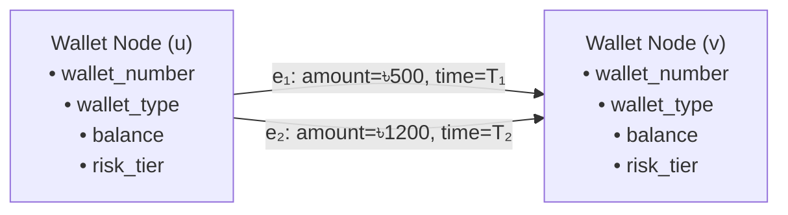
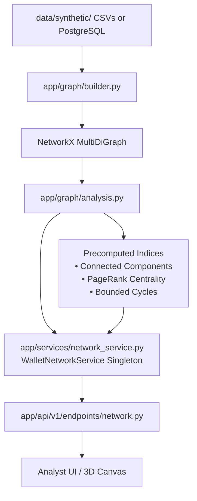

# UpayAche — Wallet Network Intelligence Architecture Specification

> **Document Version**: 1.0.0  
> **Status**: Approved Implementation Baseline  
> **Core Library**: NetworkX (`MultiDiGraph`)  
> **Latency Budget**: $< 25\text{ms}$ for 1-hop ego-extraction, $< 50\text{ms}$ for 2-hop traversal

---

## 1. Network Graph Data Model

UpayAche models MFS financial activity as an attributed, directed multigraph:

$$\mathcal{G} = (\mathcal{V}, \mathcal{E})$$



### 1.1 Node Attributes ($\mathcal{V}$ — Wallets)
Every node represents a unique MFS wallet account:
| Attribute | Type | Description |
| :--- | :--- | :--- |
| `id` | UUID (string) | Unique wallet primary key |
| `wallet_number` | String | Formatted display number (`W-PERS-0001`, `W-AGEN-0042`) |
| `phone_number_masked` | String | Strictly masked MSISDN (`017****1234`) |
| `wallet_type` | Enum | `PERSONAL`, `AGENT`, `MERCHANT` |
| `balance` | Float | Current wallet balance in BDT |
| `risk_tier` | Enum | `LOW`, `MEDIUM`, `HIGH`, `CRITICAL` |
| `is_synthetic_mule` | Boolean | True if flagged as syndicate money mule |
| `mule_cluster_role` | String | `FEEDER_SMURF`, `AGGREGATOR_CASHOUT`, or null |

### 1.2 Edge Attributes ($\mathcal{E}$ — Transactions)
Every directed edge represents an individual completed or flagged financial transfer:
| Attribute | Type | Description |
| :--- | :--- | :--- |
| `id` | UUID (string) | Unique transaction identifier |
| `source` | UUID (string) | Sender wallet ID |
| `target` | UUID (string) | Receiver wallet ID |
| `amount` | Float | Transferred amount in BDT |
| `tx_type` | Enum | `P2P`, `CASH_IN`, `CASH_OUT`, `PAYMENT`, `RECHARGE` |
| `timestamp` | ISO-8601 | Transaction execution timestamp |
| `status` | Enum | `COMPLETED`, `FLAGGED`, `BLOCKED` |
| `is_fraud` | Integer (0/1) | Known synthetic fraud label |
| `is_anomaly` | Integer (0/1) | Statistical behavioral outlier label |
| `pattern_code` | String | Controlled pattern code (e.g. `CIRCULAR_CHAIN`, `SMURFING_FAN_IN`) |

---

## 2. Topological Metric Formulations

### 2.1 Degree & Transaction Volume
For wallet $u \in \mathcal{V}$:
- **Inbound Transactions ($d_{\text{in}}$)**: Number of incoming directed edges:
  $$d_{\text{in}}(u) = |\mathcal{E}_{\text{in}}(u)|$$
- **Outbound Transactions ($d_{\text{out}}$)**: Number of outgoing directed edges:
  $$d_{\text{out}}(u) = |\mathcal{E}_{\text{out}}(u)|$$
- **Degree ($d$)**: Total transaction count:
  $$d(u) = d_{\text{in}}(u) + d_{\text{out}}(u)$$
- **Total Inflow ($V_{\text{in}}$)**: Sum of incoming funds:
  $$V_{\text{in}}(u) = \sum_{e \in \mathcal{E}_{\text{in}}(u)} \text{amount}(e)$$
- **Total Outflow ($V_{\text{out}}$)**: Sum of outgoing funds:
  $$V_{\text{out}}(u) = \sum_{e \in \mathcal{E}_{\text{out}}(u)} \text{amount}(e)$$
- **Total Transferred Amount ($V_{\text{total}}$)**: Total financial turnover:
  $$V_{\text{total}}(u) = V_{\text{in}}(u) + V_{\text{out}}(u)$$

### 2.2 Network Concentration (Herfindahl-Hirschman Index — HHI)
Quantifies whether a wallet distributes its outbound funds across diverse counterparties (benign consumer) or concentrates them into a single funnel node (mule funnel / structuring):

$$\text{HHI}(u) = \sum_{v \in \mathcal{N}_{\text{out}}(u)} \left( \frac{\sum_{e=(u,v)} \text{amount}(e)}{V_{\text{out}}(u)} \right)^2$$

- $\text{HHI} \to 1.0$: 100% of outbound liquidity is funneled into a single destination.
- $\text{HHI} \to 0.0$: Outflows are evenly distributed across many distinct recipients.

### 2.3 Suspicious Neighbor Detection (1-Hop Ego Neighborhood)
A 1-hop neighbor $v \in \mathcal{N}(u)$ is classified as suspicious if:
1. $v$'s risk tier is `HIGH` or `CRITICAL`, or
2. $v$'s `is_synthetic_mule` flag is `True`, or
3. Any transaction edge between $u$ and $v$ is flagged with `is_fraud == 1`.

The metric tracks:
- `suspicious_neighbors_count`: $|\mathcal{N}_{\text{suspicious}}(u)|$
- `suspicious_neighbor_ids`: list of connected suspicious wallet IDs.

### 2.4 Connected Components
- Weakly Connected Components (WCC) partition the graph into disjoint clusters regardless of edge direction:
  $$\mathcal{V} = \mathcal{C}_1 \cup \mathcal{C}_2 \cup \dots \cup \mathcal{C}_k$$
- An **isolated wallet** forms a trivial component of size $|\mathcal{C}_i| = 1$.
- The **main transaction network** forms the giant component ($|\mathcal{C}_1| \gg 1$).

### 2.5 Circular Layering Loops & Chain Tracing
- **Cycle Detection**: Identifies elementary directed cycles of length $3 \le k \le 5$ (e.g. $A \to B \to C \to A$) via bounded Johnson's algorithm:
  $$\text{nx.simple\_cycles}(G, \text{length\_bound}=5)$$
- **Forward Chain Tracing**: Traces fund dispersal paths $W_1 \to W_2 \to \dots \to W_m$ up to depth $4$, tracking cumulative volume and intermediate fraud flags.

---

## 3. Implementation Subsystem Architecture



### 3.1 Module Breakdown
1. **`app/graph/schemas.py`**: Pydantic models for `GraphNode`, `GraphEdge`, `NodeMetadata`, `RiskMetadata`, `NetworkGraphResponse`, `WalletNetworkSummary`, and `TransactionChain`.
2. **`app/graph/builder.py`**: Transforms Pandas DataFrames into attributed NetworkX `MultiDiGraph`.
3. **`app/graph/analysis.py`**: Core graph algorithmic routines (node metrics, HHI concentration, suspicious neighbor extraction, BFS ego expansion, cycle finding).
4. **`app/services/network_service.py`**: State management, graph index caching, and sub-millisecond query responses.
5. **`app/api/v1/endpoints/network.py`**: FastAPI router serving REST endpoints.

---

## 4. REST API Endpoint Specifications

All endpoints are hosted under `/api/v1/network`:

### 4.1 `GET /api/v1/network/graph/{wallet_id}`
Returns a structured k-hop directed ego graph formatted for 2D/3D visualization.

- **Query Parameters**:
  - `hops`: Integer (1 to 3, default: 1)
  - `max_nodes`: Integer (2 to 100, default: 50)
- **Response**: `NetworkGraphResponse`
  ```json
  {
    "nodes": [
      {
        "id": "c1000000-0000-0000-0000-000000000001",
        "label": "W-PERS-0001",
        "degree": 23,
        "inbound_transactions": 11,
        "outbound_transactions": 12,
        "transaction_count": 23,
        "total_inflow": 42150.0,
        "total_outflow": 38400.0,
        "total_transferred_amount": 80550.0,
        "component_id": 0,
        "metadata": {
          "wallet_number": "W-PERS-0001",
          "phone_number_masked": "017****1001",
          "wallet_type": "PERSONAL",
          "balance": 14200.0,
          "currency": "BDT",
          "status": "ACTIVE",
          "kyc_status": "VERIFIED"
        },
        "risk": {
          "risk_tier": "LOW",
          "is_synthetic_mule": false,
          "suspicious_neighbors_count": 0,
          "suspicious_neighbor_ids": [],
          "network_concentration_score": 0.1245,
          "in_cycle": false,
          "pagerank": 0.007812
        }
      }
    ],
    "edges": [
      {
        "id": "e1000000-0000-0000-0000-000000000045",
        "source": "c1000000-0000-0000-0000-000000000001",
        "target": "c1000000-0000-0000-0000-000000000034",
        "amount": 1450.0,
        "tx_type": "P2P",
        "timestamp": "2026-01-16T14:22:10+00:00",
        "status": "COMPLETED",
        "is_fraud": 0,
        "is_anomaly": 0
      }
    ],
    "total_nodes": 23,
    "total_edges": 97,
    "graph_metadata": {
      "node_count": 23,
      "edge_count": 97,
      "density": 0.191699,
      "is_weakly_connected": true
    }
  }
  ```

### 4.2 `GET /api/v1/network/metrics/{wallet_id}`
Returns `WalletNetworkSummary` containing topological intelligence.

### 4.3 `GET /api/v1/network/components`
Returns global connected components overview:
```json
{
  "total_components": 2,
  "component_sizes": [149, 1],
  "largest_component_size": 149,
  "isolated_wallets_count": 1
}
```

### 4.4 `GET /api/v1/network/cycles`
Returns elementary circular transaction loops (e.g. $[W_A, W_B, W_C]$).

### 4.5 `GET /api/v1/network/chains/{wallet_id}`
Returns forward fund dispersal chains up to `max_depth` hops.

---

## 5. Verification Matrix (`backend/tests/test_wallet_network.py`)

All scenarios are verified through automated unit and integration tests:

| Test Scenario | Verification Condition | Status |
| :--- | :--- | :--- |
| **Isolated Wallet** | $\text{degree}=0$, $\text{inflow}=0$, $\text{outflow}=0$, $\text{component\_size}=1$, 0 edges in ego | **PASSED** |
| **Normal Wallet** | $\text{degree} > 0$, balanced in/outflow, $\text{HHI} < 1.0$, valid node & edge metadata | **PASSED** |
| **High-Degree Wallet** | Agent/Aggregator hub ($\text{degree} \ge 30$), elevated PageRank, high transaction volume | **PASSED** |
| **Connected Suspicious Wallets** | Directly connected to mule or `CRITICAL` node $\implies \text{suspicious\_neighbors} \ge 1$ | **PASSED** |
| **Transaction Chains** | Forward traversal paths with cumulative volume and fraud attribution | **PASSED** |
| **Circular Layering** | Elementary 3-node cycle detection for laundering loops | **PASSED** |
| **REST API Integration** | HTTP 200 on all endpoints, schema validation, 404 on missing wallet | **PASSED** |
