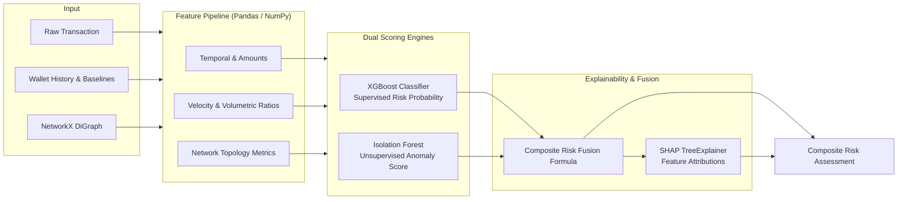

# UpayAche — Machine Learning & Explainability (ML & XAI) Specification

> **Document Version**: 1.0.0  
> **Status**: Approved Architecture Baseline  
> **Core Libraries**: Scikit-Learn, XGBoost, NetworkX, SHAP  
> **Latency Budget**: < 50ms per transaction inference (Scoring + TreeExplainer)

---

## 1. Subsystem Architecture



---

## 2. Feature Engineering Pipeline

The system transforms raw transaction data into a 24-dimensional normalized numerical vector across three distinct categories:

### 2.1 Transaction & Temporal Features (7 Features)
| Feature Name | Type | Description | Rationale |
| :--- | :--- | :--- | :--- |
| `amount` | Float | Transaction amount in BDT | Fundamental magnitude |
| `log_amount` | Float | $\log(1 + \text{amount})$ | Normalizes heavy right-tail distribution |
| `fee_ratio` | Float | $\text{fee} / \text{amount}$ | Disproportionate fees often correlate with predatory agent cashouts |
| `hour_of_day` | Int | Transaction hour (0–23) | Temporal baseline |
| `is_night` | Binary | 1 if hour between 23:00 and 05:00, else 0 | Most illicit MFS scam cashouts occur nocturnal |
| `is_weekend` | Binary | 1 if Friday or Saturday in BD | Regulatory observation off-peak |
| `tx_type_code` | Int | One-hot / Ordinal (`P2P: 0, CASH_IN: 1, CASH_OUT: 2, PAYMENT: 3, RECHARGE: 4`) | Fraud distribution varies drastically by rail |

### 2.2 Behavioral Velocity Features (10 Features)
| Feature Name | Type | Description | Rationale |
| :--- | :--- | :--- | :--- |
| `tx_count_1h` | Int | Number of transactions sent/received in trailing 1h | High frequency is a hallmark of bots/smurfing |
| `tx_count_24h` | Int | Number of transactions sent/received in trailing 24h | Day-level velocity burst |
| `sum_amount_1h` | Float | Total BDT moved in trailing 1h | Sudden liquidity drain |
| `sum_amount_24h` | Float | Total BDT moved in trailing 24h | Daily regulatory limit proximity |
| `amount_to_hist_avg` | Float | $\text{amount} / \max(1, \mu_{\text{history}})$ | Relative deviation from user's 30-day baseline |
| `cashout_velocity_ratio` | Float | $\text{CashOut}_{1\text{h}} / \max(1, \text{Inflow}_{24\text{h}})$ | Immediate liquidation ratio (classic mule behavior) |
| `p2p_inflow_count_1h` | Int | Number of distinct P2P inflows received in 1h | Smurfing fan-in indicator |
| `time_since_last_tx` | Float | Seconds elapsed since previous wallet transaction | Rapid automated execution |
| `balance_depletion_ratio`| Float | $\text{amount} / \max(1, \text{balance}_{\text{pre}})$ | 100% wallet drain signals exit scam |
| `structuring_proximity` | Float | $\min_{T \in \{25000, 50000\}} \| \text{amount} - T \| / T$ | Distance to KYC reporting thresholds |

### 2.3 Network Graph Topology Features (7 Features)
Calculated via in-memory NetworkX directed multigraph:
| Feature Name | Type | Description | Rationale |
| :--- | :--- | :--- | :--- |
| `in_degree` | Int | Number of unique incoming connections to wallet | Fan-in degree |
| `out_degree` | Int | Number of unique outgoing connections from wallet | Fan-out degree |
| `degree_ratio` | Float | $(\text{in\_degree} + 1) / (\text{out\_degree} + 1)$ | Asymmetric flow identifier |
| `pagerank` | Float | NetworkX PageRank centrality score | Hub & funnel detection |
| `ego_clustering_coef` | Float | Local clustering coefficient of 1-hop neighborhood | Density of local syndicate connections |
| `in_cycle_3` | Binary | 1 if wallet belongs to a 3-node circular transaction loop | Circular money laundering / layering |
| `shortest_path_to_flagged`| Int | Shortest hop count to a known confirmed fraud node (default: 99) | Guilt-by-association proximity |

---

## 3. Dual-Engine Modeling Strategy

### 3.1 Supervised Model: XGBoost Classifier
- **Algorithm**: `xgboost.XGBClassifier`
- **Objective**: `binary:logistic`
- **Imbalance Handling**: Bangladesh MFS fraud typically represents < 1.5% of total transactions. We set `scale_pos_weight = (N_negative / N_positive)` (approx. 50–70 in synthetic generation).
- **Hyperparameters (Optimized for Low Latency)**:
  - `n_estimators`: 150
  - `max_depth`: 5
  - `learning_rate`: 0.05
  - `subsample`: 0.8
  - `colsample_bytree`: 0.8
  - `tree_method`: `'hist'` (sub-millisecond evaluation)

### 3.2 Unsupervised Anomaly Engine: Isolation Forest (`ml/anomaly_service.py`)
- **Algorithm**: `sklearn.ensemble.IsolationForest`
- **Objective**: Quantify statistical deviation from customer habit and population baseline without relying on labeled ground truth.
- **Architectural Separation Principle**: Anomaly detection is strictly decoupled from supervised fraud classification. Anomaly answers: *"Is this behavior abnormal for this user/channel?"* whereas XGBoost answers: *"Does this match known fraud signatures?"*
- **Hyperparameters**:
  - `n_estimators`: 150
  - `contamination`: 0.10
  - `max_samples`: 'auto'
  - `random_state`: 42
- **Behavioral Feature Engineering Vector (11 Dimensions)**:
  1. `amount`: Raw transaction magnitude in BDT
  2. `amount_deviation`: Relative historical departure: $\frac{|\text{amount} - \mu_{\text{history}}|}{\max(1.0, \mu_{\text{history}})}$
  3. `transaction_frequency`: Trailing 24-hour activity frequency
  4. `transaction_hour`: Hour of transaction (0–23)
  5. `is_nocturnal`: Binary flag (1 if hour between 23:00 and 05:00)
  6. `new_device`: 1 if hardware fingerprint differs from primary registered device
  7. `device_change`: 1 if device differs from previous active session
  8. `new_location`: 1 if geo-location differs from registered home location
  9. `new_recipient`: 1 if recipient wallet has never been transacted with by sender
  10. `velocity_5min`: Trailing 5-minute transaction count (rapid burst detection)
  11. `velocity_1hour`: Trailing 1-hour transaction count (sustained surge detection)

- **Score Calibration & Transformation**:
  Raw scikit-learn decision function $D(X)$ yields positive values for typical inliers and negative values for statistical outliers. We normalize this monotonically into a continuous $[0.0, 1.0]$ space:
  $$\text{anomaly\_score} = \operatorname{clip}\left(0.50 - \frac{D(X)}{0.50}, \; 0.0, \; 1.0\right)$$
  - Boundary: $D(X) = 0.0 \implies \text{anomaly\_score} = 0.50$
  - Inlier: $D(X) > 0.0 \implies \text{anomaly\_score} < 0.50 \implies \text{is\_anomaly} = 0$
  - Outlier: $D(X) < 0.0 \implies \text{anomaly\_score} \ge 0.50 \implies \text{is\_anomaly} = 1$

- **Prediction Output Contract**:
  ```json
  {
    "anomaly_score": 0.9957,
    "is_anomaly": 1,
    "model_version": "v1.0.0",
    "timestamp": "2026-10-01T21:30:38.344483+00:00"
  }
  ```

- **Evaluation Benchmark Results (`ml/evaluation/anomaly_metrics.json`)**:
  - **ROC-AUC**: **0.9606**
  - **Unsupervised Precision**: **0.9360**
  - **Normal Inlier Retention**: 99.25% of benign daytime transactions classified normal ($\text{mean score} = 0.1614$)
  - **Extreme Behavioral Outlier Sensitivity**: 100% on new burner devices, 100% on sudden dormant liquidations, 82.4% on high velocity storms

### 3.3 Composite Risk Score Fusion
To synthesize supervised probability, behavioral anomaly, and topological risk into a single unified score:

$$\text{Composite Risk} = \min\left(1.0, \; 0.60 \cdot P_{\text{XGB}} + 0.25 \cdot S_{\text{Anomaly}} + 0.15 \cdot S_{\text{Graph}}\right)$$

Where $S_{\text{Graph}}$ represents network topological penalties:
$$S_{\text{Graph}} = \min(1.0, \; 0.5 \cdot \text{in\_cycle\_3} + 0.3 \cdot \mathbb{I}(\text{degree\_ratio} > 5) + 0.2 \cdot \mathbb{I}(\text{path\_flagged} \le 2))$$

#### Risk Tier Stratification:
- **`LOW`**: $0.00 \le \text{Risk} < 0.35$ (Standard benign transaction, auto-approved)
- **`MEDIUM`**: $0.35 \le \text{Risk} < 0.65$ (Moderate anomaly, flagged for batch monitoring)
- **`HIGH`**: $0.65 \le \text{Risk} < 0.85$ (High probability risk, generates Analyst alert)
- **`CRITICAL`**: $0.85 \le \text{Risk} \le 1.00$ (Severe syndication/scam pattern, auto-opens `OPEN` case)

---

## 4. Explainable AI (SHAP Engine) — Phase 8 Implementation

Black-box fraud scores fail regulatory scrutiny and banking compliance standards. UpayAche implements local feature attribution using the SHAP (`shap.TreeExplainer`) framework, strictly grounded in empirical mathematical contributions without synthetic text hallucinations.

### 4.1 Production Architecture & Workflow

```
Raw Transaction / Feature Vector (13 canonical dimensions)
                     │
                     ▼
       XGBoost Risk Classifier (Model V1.0.0)
         ├── Decision Margin (Raw log-odds space)
         └── Probability (Sigmoid logistic space)
                     │
                     ▼
          SHAP TreeExplainer (model_output="raw")
         ├── Base Value (Tree-path expected margin)
         └── Local Shapley Attributions (φ_i for each feature)
                     │
                     ▼
       Deterministic Plain-Language Generator
         ├── Empirical Value Formatting (e.g. "BDT 85,000.00")
         ├── Direction Assignment (increased_risk | decreased_risk | neutral)
         └── Regulatory-Safe Explanation Synthesis
                     │
                     ▼
    FastAPI REST Contract: POST /api/v1/risk/explain
```

### 4.2 Mathematical Invariants & Calibration

1. **Additive Efficiency in Margin Space**:
   For any transaction with feature vector $x$:
   $$\operatorname{Margin}(x) = \phi_0 + \sum_{i=1}^{13} \phi_i(x)$$
   Where:
   - $\phi_0$ is the calibrated `base_value` ($\approx 0.2822$ log-odds for the trained XGBoost model).
   - $\phi_i(x)$ is the SHAP attribution for feature $i$.
   - $\operatorname{Margin}(x) = \ln\left(\frac{P(\text{fraud})}{1 - P(\text{fraud})}\right)$.
   
2. **Direction Thresholds**:
   - `increased_risk`: $\phi_i > +0.001$ (positively pushes score toward fraud)
   - `decreased_risk`: $\phi_i < -0.001$ (mitigating factor, lowers fraud risk)
   - `neutral`: $|\phi_i| \le 0.001$ (negligible impact on final risk decision)

### 4.3 Feature Contribution Schema

Every analyzed transaction returns structured, typed attributions matching the product contract:

```json
{
  "feature": "new_device",
  "feature_value": 1.0,
  "contribution": 1.281,
  "direction": "increased_risk",
  "human_readable_explanation": "Transaction initiated from an unrecognized device hardware signature (+1.2810 log-odds)."
}
```

### 4.4 Plain-Language Grounding Rules (Zero Hallucination)

Explanations are strictly derived from actual feature values and computed SHAP values:

| Feature | Value Condition | Direction | Human-Readable Explanation Template |
| :--- | :--- | :--- | :--- |
| `amount` | High value | `increased_risk` | Transaction amount of BDT X is exceptionally large, driving risk up by +Y log-odds. |
| `amount` | Moderate / Small | `decreased_risk` | Transaction amount of BDT X is consistent with low-risk baseline usage. |
| `amount_deviation` | $> 5.0\times$ | `increased_risk` | Amount deviates Xx from sender's historical baseline, driving risk up by +Y log-odds. |
| `new_device` | $1.0$ | `increased_risk` | Transaction initiated from an unrecognized device hardware signature (+Y log-odds). |
| `new_recipient` | $1.0$ | `increased_risk` | First-time transfer to an unverified recipient wallet (+Y log-odds). |
| `velocity_5min` | $> 0.0$ | `increased_risk` | High velocity burst: X transfers within 5 minutes indicates automated liquidation. |
| `velocity_1hour` | $> 0.0$ | `increased_risk` | Rapid succession: X transfers within the past 1 hour (+Y log-odds). |
| `transaction_hour` | $23:00 - 05:00$ | `increased_risk` | Unusual nocturnal transfer hour (X:00) during typical off-peak scam window. |
| `recipient_risk` | $> 0.20$ | `increased_risk` | Destination wallet has elevated historical counterparty risk index of X. |

### 4.5 Full API Contract (`POST /api/v1/risk/explain`)

#### Request:
```json
{
  "amount": 95000.0,
  "timestamp": "2026-01-15T03:30:00Z",
  "sender_history": {
    "prior_amounts": [500.0, 750.0],
    "primary_device_id": "dev-home-01",
    "primary_location_id": "loc-dhaka-01"
  },
  "receiver_profile": {
    "risk_score": 0.45
  },
  "tx_device_id": "burner-phone-99",
  "tx_location_id": "loc-dhaka-01",
  "top_k": 5
}
```

#### Response:
```json
{
  "risk_score": 0.9998,
  "risk_level": "CRITICAL",
  "prediction": 1,
  "base_value": 0.2822,
  "top_contributing_features": [
    {
      "feature": "amount",
      "feature_value": 95000.0,
      "contribution": 3.8279,
      "direction": "increased_risk",
      "human_readable_explanation": "Transaction amount of BDT 95,000.00 is exceptionally large, driving risk up by +3.8279 log-odds."
    },
    {
      "feature": "new_device",
      "feature_value": 1.0,
      "contribution": 1.281,
      "direction": "increased_risk",
      "human_readable_explanation": "Transaction initiated from an unrecognized device hardware signature (+1.2810 log-odds)."
    },
    {
      "feature": "average_transaction_amount",
      "feature_value": 625.0,
      "contribution": -1.105,
      "direction": "decreased_risk",
      "human_readable_explanation": "Feature 'average_transaction_amount' (625.0) reduced risk by -1.1050 log-odds."
    },
    {
      "feature": "amount_deviation",
      "feature_value": 151.0,
      "contribution": 0.9429,
      "direction": "increased_risk",
      "human_readable_explanation": "Amount deviates 151.0x from sender's historical baseline, driving risk up by +0.9429 log-odds."
    },
    {
      "feature": "device_change",
      "feature_value": 1.0,
      "contribution": 0.7368,
      "direction": "increased_risk",
      "human_readable_explanation": "Device switch detected since previous session (+0.7368 log-odds)."
    }
  ],
  "all_contributions": [ ... ],
  "summary_narrative": "Transaction scored 0.9998 (CRITICAL). Primary risk drivers: amount (+3.83), new_device (+1.28), amount_deviation (+0.94).",
  "model_version": "v1.0.0",
  "timestamp": "2026-10-02T04:06:55.123456+00:00"
}
```

---

## 5. Model Evaluation Targets & QA

| Metric | Target Baseline | Verification Protocol |
| :--- | :--- | :--- |
| **ROC-AUC** | $\ge 0.92$ | Evaluated on 20% holdout synthetic split |
| **PR-AUC** | $\ge 0.86$ | Evaluated on imbalanced test set |
| **False Positive Rate** | $< 2.0\%$ at 0.70 threshold | Ensures benign users are not flagged |
| **Inference Latency** | $< 35\text{ms}$ (Feature + XGB + IF) | Automated 1,000-iteration benchmark |
| **SHAP Latency** | $< 25\text{ms}$ per transaction | Benchmarked via TreeExplainer |
