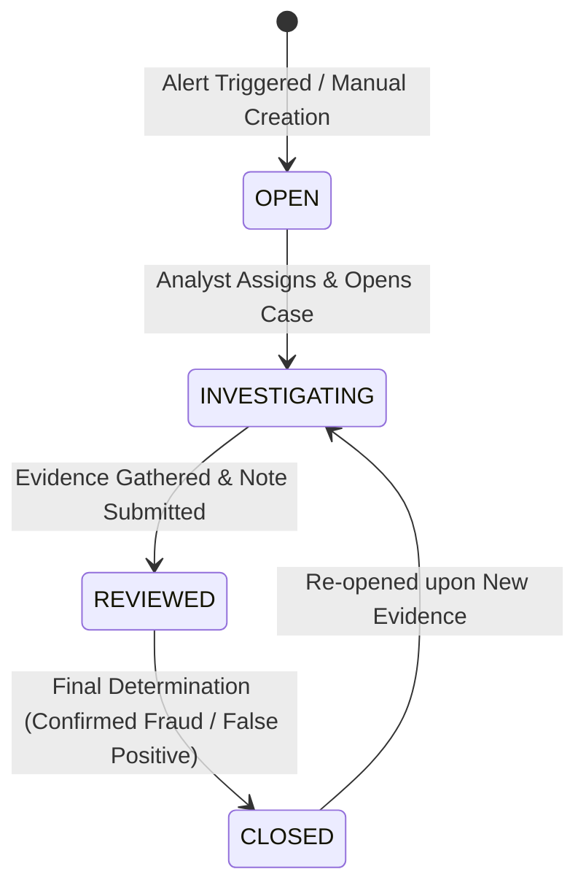

# UpayAche — Product Requirements Document (PRD)

> **Document Version**: 1.0.0  
> **Status**: Approved Architecture Baseline  
> **Target Horizon**: 3-Day Hackathon Prototype (DIU CPC × upay AI Hackathon 2026 Inspiration)  
> **Product**: UpayAche — AI-Powered MFS Risk & Scam Intelligence  
> **Tagline**: *See the risk. Understand the reason. Investigate the network.*  
> **Disclaimer**: UpayAche is a student hackathon prototype and not an official upay product.

---

## 1. Executive Summary & Problem Statement

### 1.1 The Challenge in Mobile Financial Services (MFS)
Mobile Financial Services in Bangladesh (such as upay, bKash, and Nagad) process millions of micro-transactions daily across P2P, Agent Cash-In/Cash-Out, Merchant Payments, and Utility bills. However, bad actors exploit these rapid digital rails through sophisticated schemes:
- **Mule Networks & Funneling**: Using dormant or recruited student/rural accounts as intermediary hops to siphon illicit funds.
- **Structuring / Smurfing**: Splitting large illicit sums into micro-transfers (just below regulatory thresholds like ৳25,000) to evade threshold alerts.
- **Social Engineering & Lottery Scams**: Tricking victims into rapid P2P transfers, followed immediately by nocturnal cash-outs at distant agents.
- **Circular Layering**: Circulating money through cyclic wallet rings to obscure source and destination.

Traditional rules-based alerting systems suffer from two fatal flaws:
1. **High False Positive Rates**: Rigid if-then triggers overwhelm compliance analysts with benign high-volume users.
2. **The "Black Box" Explanation Gap**: When modern ML flags a transaction, human analysts are left without clear evidence of *why* it was flagged or *how* the wallet connects to broader fraud syndicates.

### 1.2 The UpayAche Solution
UpayAche bridges the gap between machine intelligence and human compliance:
- **Detect**: Dual ML engine (supervised XGBoost + unsupervised Isolation Forest) scores synthetic MFS transactions in real-time.
- **Explain**: Local SHAP feature attribution breaks down exact risk contributors into plain, quantifiable drivers.
- **Visualize**: Interactive 3D/2D network graph reveals multi-hop wallet relationships, mule chains, and circular fund flows.
- **Investigate**: Guarded Gemini Copilot synthesizes structured evidence into investigative leads and hypotheses.
- **Human Action**: Complete analyst workflow from alert triage to case creation, note taking, status transition, and audit logging.

---

## 2. User Roles & Permissions Matrix

The system enforces three strict roles across both backend APIs and the frontend UI:

| Feature / Capability | VIEWER | ANALYST | ADMIN |
| :--- | :---: | :---: | :---: |
| View High-Level Dashboard & Aggregated Metrics | ✅ | ✅ | ✅ |
| Browse Transaction Ledger & Risk Scores | ✅ (Masked) | ✅ | ✅ |
| Inspect SHAP Feature Explanations | ✅ | ✅ | ✅ |
| Explore 3D/2D Network Visualizer | ✅ (Read-only) | ✅ | ✅ |
| Create New Investigation Case | ❌ | ✅ | ✅ |
| Update Case Status (`OPEN` → `INVESTIGATING` → `REVIEWED` → `CLOSED`) | ❌ | ✅ | ✅ |
| Add Analyst Notes & Evidence Attachments | ❌ | ✅ | ✅ |
| Query Guarded Gemini Copilot | ❌ | ✅ | ✅ |
| View System Audit Trail | ❌ | ✅ (Case-only) | ✅ (Full System) |
| Manage System Configs & ML Thresholds | ❌ | ❌ | ✅ |
| Manage User Roles & Provisioning | ❌ | ❌ | ✅ |

---

## 3. Investigation State Machine

Every flagged alert or manual case transitions through a strict, deterministic lifecycle:

### State Definitions:
1. **`OPEN`**:
   - Initial state when a transaction breaches the risk threshold (Composite Risk Score ≥ 0.70) or an analyst flags a suspicious wallet.
   - Unassigned or assigned to the triage pool.
2. **`INVESTIGATING`**:
   - An active analyst has claimed the case.
   - Network graphs are being inspected, SHAP waterfall evaluated, and Gemini Copilot consulted.
3. **`REVIEWED`**:
   - Investigation notes, hypotheses, and evidence findings have been compiled by the analyst.
   - Ready for final disposition or peer compliance sign-off.
4. **`CLOSED`**:
   - Final resolution reached. Analyst records determination: `CONFIRMED_FRAUD`, `FALSE_POSITIVE`, or `SUSPICIOUS_MONITOR`.
   - Immutable audit log entry generated. State can only be reopened by an Admin or with new transaction evidence.

---

## 4. User Journeys

### 4.1 Primary Journey: Compliance Analyst (Alert to Resolution)
1. **Login & Triage**:
   - Analyst logs in via Supabase Auth.
   - Lands on the **Overview Dashboard**, seeing real-time risk distribution, critical alert banners, and high-velocity spikes.
2. **Deep Dive into Risk Ledger**:
   - Clicks on a `CRITICAL` risk alert (e.g., Transaction `TX-89211`, Risk Score: `0.92`).
   - Opens the **Transaction Detail Drawer**.
   - Evaluates the **SHAP Waterfall**: observes that `velocity_1h_ratio (+0.38)`, `night_time_cashout (+0.24)`, and `network_degree_centrality (+0.18)` are the primary drivers.
3. **Network Investigation**:
   - Clicks **"Explore in 3D Network"**.
   - The interactive Three.js canvas centers on sender wallet `017****9812`.
   - Analyst expands 2 hops: discovers a 5-node mule fan-in pattern funneling funds into this wallet right before a Cash-Out at an Agent wallet.
4. **AI Copilot Synthesis**:
   - Analyst opens **Gemini Investigation Assistant**.
   - Gemini receives strictly structured evidence (transaction attributes, SHAP top 3 factors, 2-hop graph summary).
   - Gemini responds with a structured briefing: "High probability of Structuring/Smurfing. Sender received 4 micro-P2P transfers within 12 minutes followed by a 94% volume Cash-Out."
5. **Case Action & Resolution**:
   - Analyst clicks **"Create Case"** (Case state: `OPEN` → `INVESTIGATING`).
   - Copies key findings, adds analyst commentary: *"Mule aggregation pattern verified via 3D graph. Agent wallet flagged for regional inspection."*
   - Transitions case to `REVIEWED`, then disposes as `CLOSED` (Confirmed Fraud).
   - System records the complete audit log.

### 4.2 Secondary Journey: Risk Admin (System Governance)
1. **Model & Threshold Tuning**:
   - Admin views the **Analytics & Performance** page.
   - Inspects ROC-AUC (0.94 target), Precision-Recall curves, and false-positive rates on synthetic batches.
   - Adjusts alert sensitivity threshold slider (e.g., from 0.70 to 0.65 for high-volume holidays).
2. **Audit Oversight**:
   - Inspects the **System Audit Log** to ensure analyst decisions comply with turnaround standards and that no unauthorized state overrides occurred.

### 4.3 Tertiary Journey: Viewer / Executive
1. **Read-Only Dashboard**:
   - Views overall synthetic transaction volume, scam typology distribution (Mule Chains vs. Smurfing vs. Lottery Scams).
   - Reads anonymized summary reports and model health metrics without modifying cases or accessing raw operational workflows.

---

## 5. Scope & Feature Prioritization (Hackathon 3-Day Plan)

To guarantee a polished, stable, and zero-defect submission, features are categorized into strict priority buckets:

### 5.1 MUST HAVE (P0 — Core Hackathon Deliverables)
- **Synthetic Data Pipeline**: Deterministic generator for 5,000+ realistic synthetic Bangladeshi MFS transactions (P2P, Cash-In, Cash-Out, Merchant, Recharge) containing embedded fraud patterns (Smurfing, Mule Funnels, Rapid Cash-Out).
- **Dual ML Risk Scoring Engine**:
  - Supervised XGBoost classifier for transaction risk scoring.
  - Unsupervised Isolation Forest for behavioral deviation scoring.
  - Unified Composite Risk Score (0.00 – 1.00) categorized into `LOW`, `MEDIUM`, `HIGH`, `CRITICAL`.
- **SHAP Local Explainability**: TreeExplainer calculating exact feature attributions displayed via a visual waterfall/bar chart.
- **NetworkX Graph Engine**: Construction of multi-hop wallet graphs, detecting cycles, fan-in/fan-out, and degree centrality.
- **FastAPI Backend**: Fully typed REST API with Pydantic v2 schemas for all endpoints.
- **Supabase Integration**: Auth, PostgreSQL database, and Row Level Security (RLS) for user roles.
- **Next.js + Tailwind UI**: Production-grade dark fintech dashboard with responsive layout and modern typography.
- **3D Network Visualizer**: Interactive Three.js / React Three Fiber canvas displaying wallet nodes, directed transaction edges, risk color coding, and node-click inspection.
- **Guarded Gemini Copilot**: Official `google-genai` integration with strictly guarded structured evidence input and structured investigative report output.
- **Case Lifecycle Management**: Full CRUD for cases with states (`OPEN`, `INVESTIGATING`, `REVIEWED`, `CLOSED`), analyst notes, and audit logs.

### 5.2 SHOULD HAVE (P1 — High Value Polish)
- **Live Transaction Stream Simulator**: Periodic polling/streaming simulation feeding new synthetic transactions into the dashboard feed.
- **Model Analytics Dashboard**: Interactive Recharts displaying ROC-AUC curve, Confusion Matrix, and inference latency statistics.
- **Graph Filter Controls**: Filter 3D visualizer by transaction type, minimum risk score, and date range.
- **Exportable Case Dossier**: One-click printable/exportable investigation summary report.

### 5.3 OPTIONAL (P2 — Stretch / Hackathon Cherry-on-Top)
- **Multi-wallet Batch Triage**: Bulk assign alerts to analysts.
- **Agent Geolocation Proximity Map**: 2D leaflet map showing synthetic agent locations for cash-out clustering.
- **Voice-to-Text Analyst Notes**: Audio transcription for quick analyst note taking.

---

## 6. Measurable Success Criteria

| Dimension | Target Metric | Verification Method |
| :--- | :--- | :--- |
| **Inference Latency** | < 100ms per transaction scoring (ML + SHAP) | Automated backend performance benchmark |
| **Model Quality** | ROC-AUC ≥ 0.90, PR-AUC ≥ 0.85 on synthetic test set | Evaluated via Scikit-learn test split |
| **Graph Scaling** | Smooth 60 FPS rendering for 500+ nodes in 3D canvas | WebGL frame profiler |
| **Security & Safety** | 0 secrets in client, 100% guarded Gemini prompts | Static code scan + architectural review |
| **Demo Completion** | Complete 3-minute uninterrupted live demo walk | Execution against predefined demo script |
