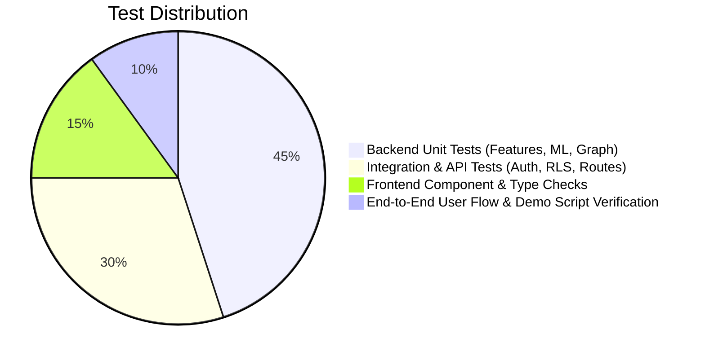

# UpayAche — Quality Assurance & Testing Strategy (QA)

> **Document Version**: 1.0.0  
> **Status**: Approved Architecture Baseline  
> **Coverage Goal**: Zero crash tolerance during live demonstration, high deterministic reliability

---

## 1. Testing Pyramid & QA Philosophy

1. **No Fake Responses**: All test fixtures use realistic synthetic MFS transaction models.
2. **State Machine Strictness**: Every test for case management verifies valid transitions (`OPEN` → `INVESTIGATING` → `REVIEWED` → `CLOSED`) and rejects invalid state hops.
3. **Role Enforcement**: Every mutating API route must have automated tests proving that `VIEWER` gets `403 Forbidden` while `ANALYST` and `ADMIN` succeed.
4. **Resilience to External Outages**: Gemini assistant tests verify both live GenAI calls and deterministic local fallbacks when external APIs time out.

---

## 2. Backend Test Suites (`pytest`)

### 2.1 Feature Pipeline & Math Correctness (`tests/test_features.py`)
- **Zero History Baseline**: Verifies that new wallets with no prior transactions do not crash due to division-by-zero when calculating `amount_to_hist_avg`.
- **Temporal Boundaries**: Tests midnight (00:00), dawn (05:00), and day boundaries for `is_night` and `hour_of_day`.
- **Rapid Velocity**: Verifies trailing 1h and 24h rolling windows on synthetic micro-transactions.
- **Normalization Stability**: Verifies `log_amount` and ratio bounds remain within $[0.0, \infty)$ without `NaN` or `Inf`.

### 2.2 ML Model & SHAP Explainer (`tests/test_models.py`)
- **Deterministic Inference**: Verifies that calling `predict_proba()` produces identical output given identical input vectors.
- **SHAP Additivity Check**: Verifies that the sum of Shapley values plus the expected base value equals the model's raw margin score within $\pm 1e-4$.
- **Inference Latency Benchmark**: Asserts that 1,000 transactions evaluate within 50ms total per transaction budget.
- **Anomaly Score Normalization**: Verifies that Isolation Forest outputs normalize cleanly into $[0.0, 1.0]$.

### 2.3 Network Graph Algorithms (`tests/test_graph.py`)
- **Cycle Detection**: Builds a known 3-wallet circular flow (`W-1` → `W-2` → `W-3` → `W-1`) and verifies `in_cycle_3 == True`.
- **Fan-In / Fan-Out Identification**: Builds a smurfing topology (8 senders to 1 mule) and verifies that `in_degree == 8` and `degree_ratio == 8.0`.
- **Disconnected Node Handling**: Verifies that isolated wallets with 0 connections return PageRank `0.0` without crashing.

### 2.4 API Routes & Security Tests (`tests/test_api.py`)
- **Auth Rejection**: Verifies that calling `/api/v1/cases` without an `Authorization` header returns `401 Unauthorized`.
- **RBAC Matrix**:
  - `VIEWER` calling `POST /api/v1/cases` receives `403 Forbidden`.
  - `ANALYST` calling `POST /api/v1/cases` receives `201 Created`.
- **Investigation State Transitions**:
  - `OPEN` → `INVESTIGATING`: `200 OK`.
  - `OPEN` → `CLOSED`: `422 Unprocessable Entity` (Direct closure without review rejected).
  - `REVIEWED` → `CLOSED` with `PENDING` resolution: `422 Unprocessable Entity` (Resolution required).
- **Gemini Fallback Test**: Simulates network timeout on Google GenAI SDK; verifies that backend returns a valid `GeminiInvestigationReport` using the fallback engine.

---

## 3. Frontend Quality & Validation

### 3.1 Strict TypeScript & Linting
- Strict mode enabled (`tsconfig.json`: `"strict": true`, `"noImplicitAny": true`).
- Run `npm run type-check` (`tsc --noEmit`) to verify 0 type errors across components, hooks, and stores.

### 3.2 UI States Coverage
Every core component must gracefully render 4 distinct states:
1. **Loading State**: Skeleton loaders for metric cards, table rows, and network canvas spinner.
2. **Empty State**: Friendly, clean graphics and explanatory messages when filters return 0 results.
3. **Error State**: Non-blocking toast alerts and inline error boundaries with a "Retry" button.
4. **Data State**: Polished, responsive layout adhering to the dark fintech design system.

---

## 4. Edge Cases & Boundary Conditions Matrix

| Scenario | Risk | Expected Behavior | Verification Test |
| :--- | :--- | :--- | :--- |
| **New wallet with 1st transaction** | Division by zero in velocity ratios | Graceful fallback: ratios default to 1.0; history defaults to transaction amount | `test_features.py::test_new_wallet_defaults` |
| **Micro-amount (৳1.00)** | Float precision issues | Amount rounds correctly, fee calculated accurately | `test_features.py::test_micro_amount` |
| **Mega-amount (৳50,000,000.00)** | Model saturation / overflow | Handled cleanly; score tops out at 1.00 without numeric instability | `test_models.py::test_large_amount_saturation` |
| **Dense Graph (1,000+ nodes)** | 3D canvas WebGL frame drop | Visualizer limits initial render to 2-hop radius of selected wallet | `NetworkCanvas3D` render benchmark |
| **Gemini API Down / Key Expired** | Blank investigation drawer | Backend fallback engine produces rule-based synthesis within 10ms | `test_api.py::test_gemini_fallback` |
| **Concurrent Status Updates** | State conflict race condition | Postgres row lock (`SELECT FOR UPDATE`) prevents conflicting status transitions | `test_api.py::test_concurrent_case_update` |

---

## 5. Automated QA Execution Checklist

Before declaring any implementation phase complete:
1. Backend tests pass: `pytest backend/tests -v`
2. Frontend type check passes: `npm run type-check` (or `npx tsc --noEmit`)
3. Linting passes: `npm run lint` / `flake8 backend`
4. Seed scenario verification: Ingest seed scenario and verify that high-risk fraud cases appear in `OPEN` state.
